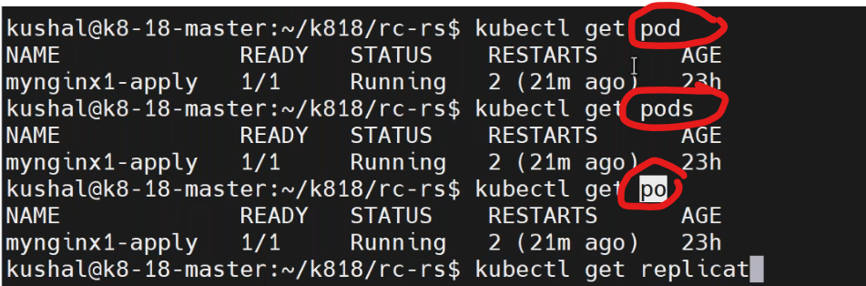
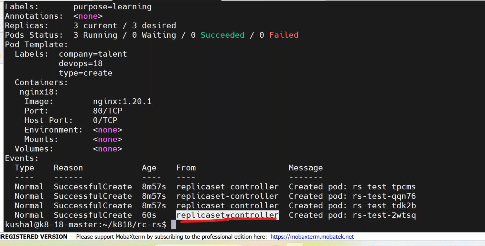
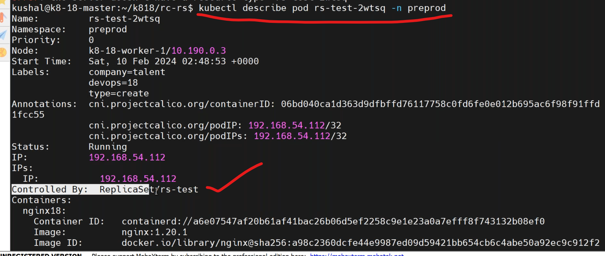
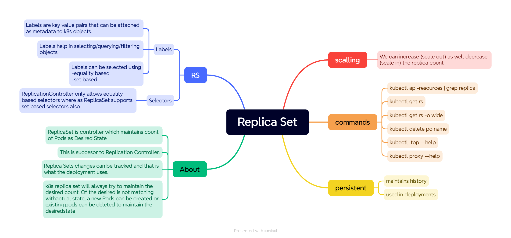
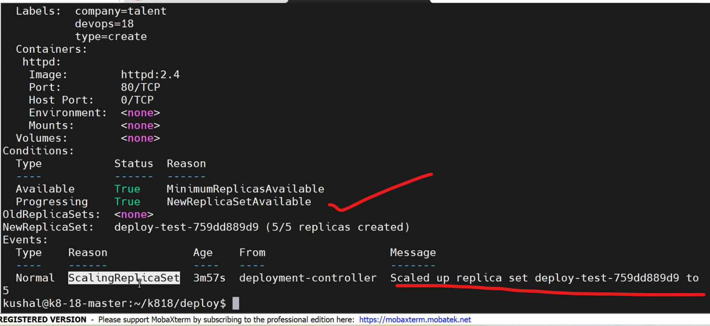
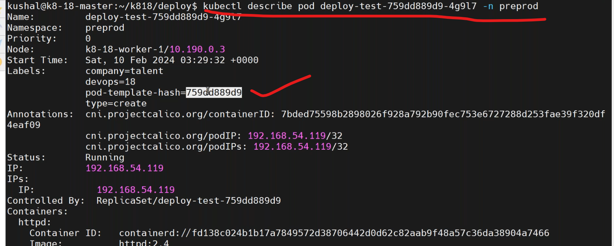
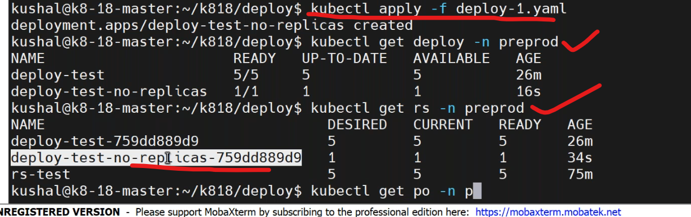

## replicaset
-------------------------
* write a manifestfile for replicaset `vi rs.yaml`.
```yaml
apiVersion: apps/v1  # related to application deployments
kind: ReplicaSet
metadata:
  name: replicaset
  labels:
    purpose: learningrs
  namespace: preprod
spec:
  replicas: 5
  selector:
    matchLabels:
      company: vtalent  # match the label mentioned in podspec metadata
  template:
    metadata:
      name: rs-nginx
      labels:
        env: dev
        company: vtalent
    spec:
      containers:
        - name: rs-nginx-con
          image: nginx:1.23
          ports:
            - containerPort: 80
```
* deploy the manifest by,
```
kubectl api-resources | grep replication
kubectl apply -f rs.yaml
kubectl describe rs <rs-name> -n preprod
```
* `replicaset`.
     1. Its a superset of Replication Controller.
     2. its advanced of RC.
     3. Replicaset support set-based label matching where this is not supported in RC.
     4. replica set internally generate special label 'pod-template-hash=759dd889d9' and add to each pod.



* service and replicationcontroller ther is no need to match labels but whenever we working on job,deployment,replicaset,daemonset these supports setbased requirements(match labels).
* replicaset is `persistent` but replicationcontroller is `not persistent`.
* histroy can be maintained by replicaset,so it is used in deployments.

## ways to update the k8 resources:
-------------------------------------
1. by updating maniefest file and apply the changes.
2. by editing existing resources
``` 
kubectl edit <resourcename> -n <namespace>
```
1. by using scale command.
  * supported for deployment,statefulset.
```
kubectl scale rs rs-test -n preprod --replicas=2
```
* `best approach` : always update manifest files.
### *here added all k8s files to github repository.
* [refere here](https://github.com/malleshdevops/devops18-k8-files.git) for repo link.
## Deployments:
---------------------------
* `stateless application` : 
   * where we don't have any kind of data storing.
* `stateful application`: 
   *  keeping data storage as part of application.
* To deploy stateless application we used Deployments.
* it provide more than one pod or selfhealing or automatic rollout.
*  write a deployment manifest `vi deployment.yaml`.
```yaml
apiVersion: apps/v1
kind: Deployment
metadata:
  name: deployment
  labels: 
    purpose: learning
spec:
  replicas: 5
  selector:
    matchLabels:
      env: dev
  strategy:
    type: RollingUpdate
    rollingUpdate:
      maxUnavailable: 25%
  template:
    metadata:
      name: deployment-pod
      labels:
        env: dev
        company: vtalent
    spec: 
      containers:
        - name: nginx-deployment
          image: nginx:1.23
          ports:
            - containerPort: 80
```
* deploy the manifest file by,
```
kubectl apply -f deployment.yaml
kubectl get deploy
kubectl describe deploy <pod-name> -n preprod
kubectl get rs -n preprod
kubectl describe rs <rs-name> preprod
```



* write a deployment manifestfile without replicas section `vi norepdeploy.yaml`.
```yaml
apiVersion: apps/v1
kind: Deployment
metadata:
  name: deployment
  labels: 
    purpose: learning
spec:
  selector:
    matchLabels:
      env: dev
  strategy:
    type: RollingUpdate
    rollingUpdate:
      maxUnavailable: 25%
  template:
    metadata:
      name: deployment-pod
      labels:
        env: dev
        company: vtalent
      spec: 
        containers:
          - name: nginx-deployment
            image: nginx:1.23
            ports:
              - containerPort: 80
```

* how many resources created when we write a deployment manifest file and deploy it??
  * deployment
  * replicaset
  * pod


  


 


