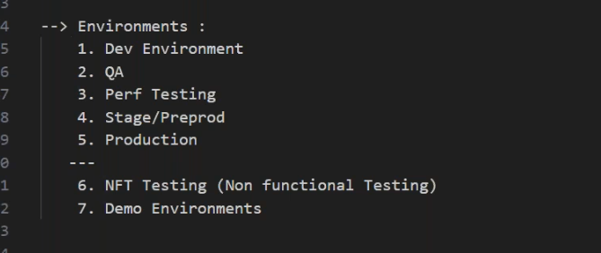

# 08/05/2024
----------------------------------------
----------------------------------------

## project
----------------------------------------------------------------
1. how to explain the project in interviewes?
   * project details
   * explain about u r project architecture?
   * how many modules(microservices) in the project?


## AWS Cloud
----------------------------------------------------------------


## Technologies
----------------------------------------------------------------


## Environments
----------------------------------------------------------------


## * how many EKS Clusters in the project?
 * each environment will have independent clusters.
 * all `dev environments` will have separate AWS Account.
  ```
  Dev/Qa/Performance testing ---> `one AWS Account`.
  ```
* all `production environments` will have separate AWS Account.
  ```
  Preproduction/Production ---> `Another AWS Account`
  ```
  * sometimes customer will `pay` the cost to these environments.
* if we use k8s in on-premises we use `namespace` instead of different aws accounts and clusters.
  * example case is `openshift`.

### who will do cost optimization?
* Devops lead and project architect will optimize.
* we don't have a access to the billing dashboard also.

## Manual k8s
----------------------------------------------------------------
* 3 master nodes for high availability of cluster.
  

## AWS Guard duty
----------------------------------------------------------------


# 09/05/2024
---------------------------
---------------------------

# EKS cluster
--------------------------------------------------------------------------
### worker nodes
-----------------------

* bastian machine: `t2.medium`.
* jenkins: `m5.2xlarger`.
* atleast `10 worker nodes` with different sizes.
### questions
---------------------
1. which region?
2. how many subnets public/private?
   * in eks cluster we have by default 3 public and 3 private.
3. is hpa enabled for all microservices?
   * no one enabled hpa for databases.
   * we r using aws rds.
4. how r u assigning specific microservices to specific nodes?
   * `nodeselector` and `node affinity`.
5. how often seen issues in the eks cluster?
   * no issues with EKS cluster,only issues in pods and nodes.
  pods:
    * restarting pods.
    * pending status pods.
    * cpu and memory.
  workernodes:
    * if there is any unplanned maintaince/issues from AWS.
6. how frequently u do the EKS upgrade?
   * every new release available for every 6 months.

# Sprint Release
--------------------------------------------------------
 
  
# branching stratagy
----------------------------------------------------
 


# 10_05_2024
------------------------------------------------------------------
# Change management process
-----------------------------------------------------------------------------
 
  ## change document
  -------------------------------------
  

  * CAB team members are non techinical (process managements).

# Incident process
--------------------------------------------------------------

 
### incident template
--------------------------------


 # Daily activities
 -----------------------------------------------------


* Incident RCA (root cause analysis).
 
# general suggesions
---------------------------------------------

