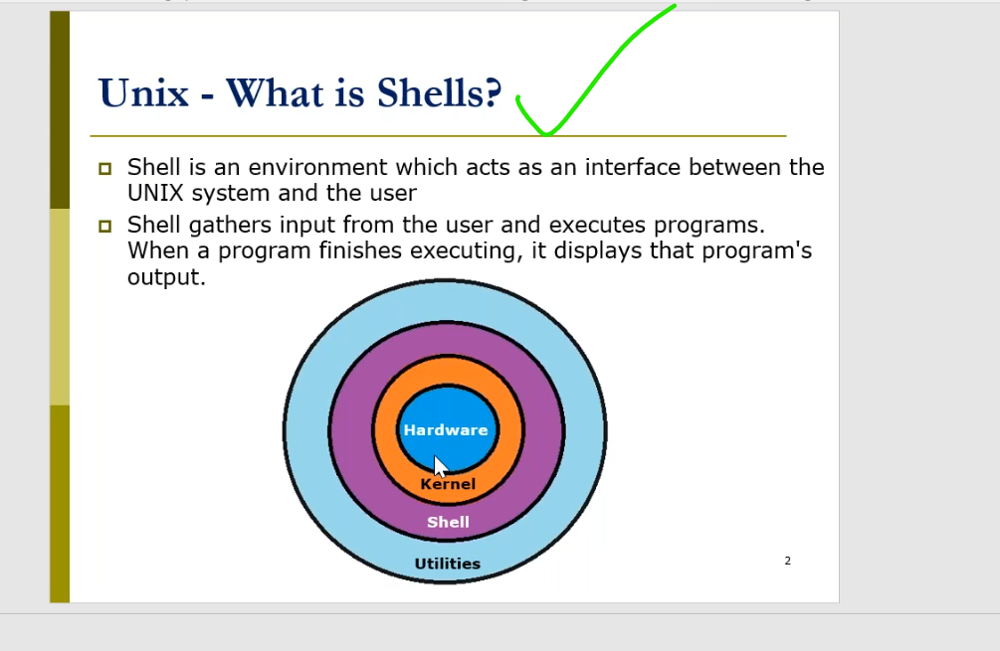
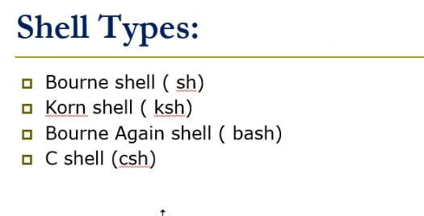
## everything in shell is process.
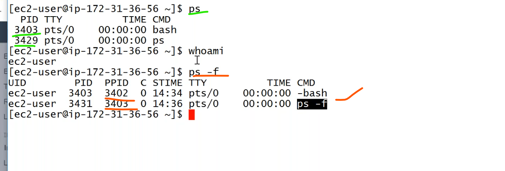
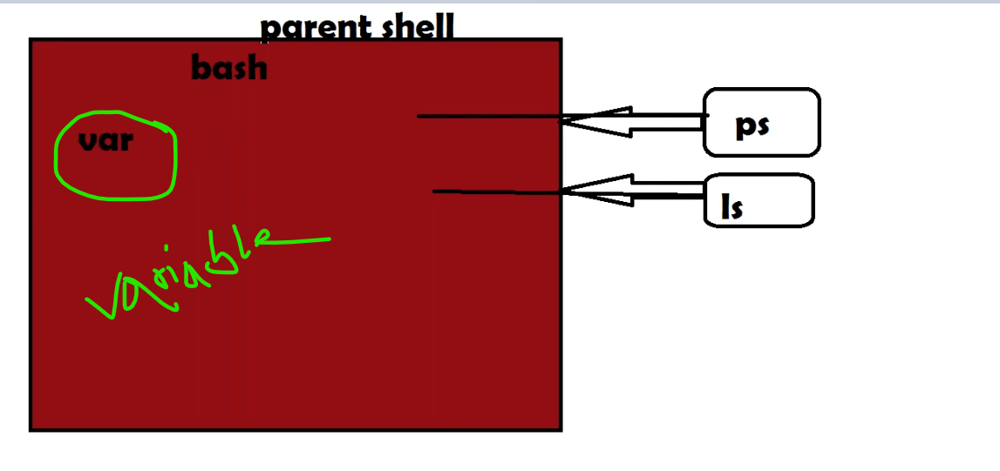
## varaible

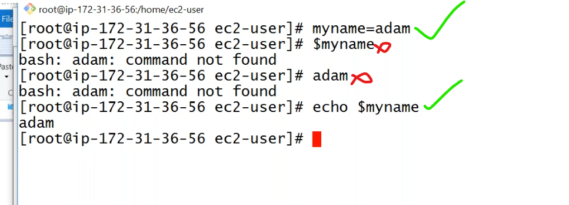
* it stores variable value in that particular shell.
* to see the system stored `environment varaibles`,
```
env
```
* examples of system variables.
```
echo $USER
echo $HOSTNAME
echo $SHELL
```
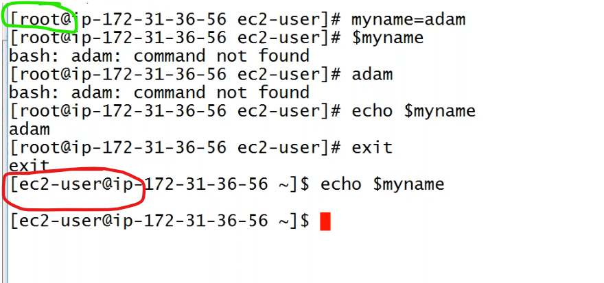
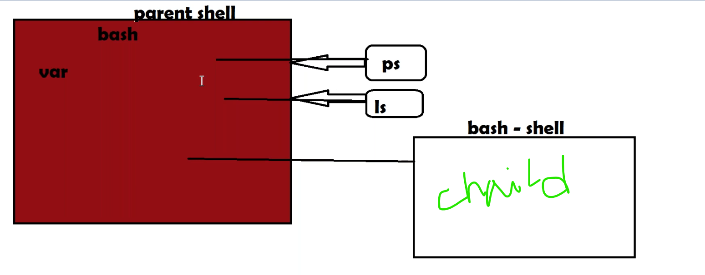
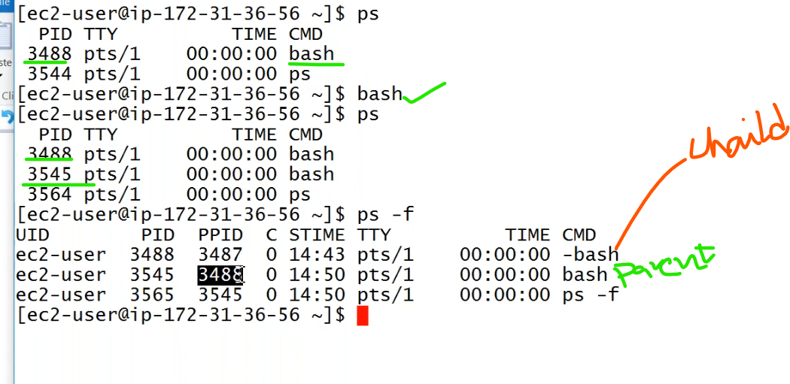
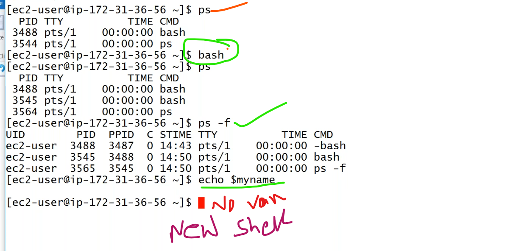
* if are in a shell `bash`,and again creating a new shell `bash`,
  - if we store one varaible in parent shell means first `bash`,this varaible value not available in second `bash` or child bash.
  - our variable value stored in specific to shell.
* if we want to staore the same value in different shells we have to use the `export` the value.
```
export myname=adam
```
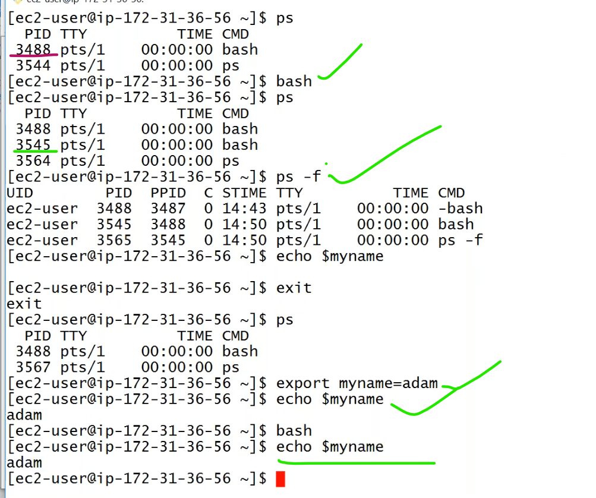
* we may be create multiple shells but at a time we can work only one shell.
* varaible is only export to `Parent to Child`.if anything variable in child we can not export to parent.
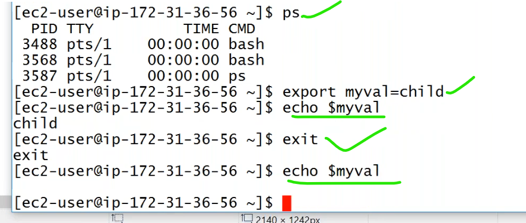
* to know the return status of the process we use.
```
echo $?
```
* if it is `0`: the previous command/process executed is `success`.
* other than `0`: the process/command executed is `unsuccess`.
  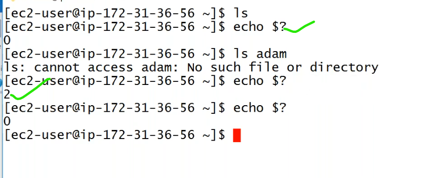
* to know the `processid` id current process.
```
echo $$
```
##  if we use to execute two commands,
```
cd /tmp && touch 1.txt
```
### other way of doing
```
cd /tmp; touch 2.txt
```
## redirecting the output commands use pipe `|`
```
ls | wc -l
```
## runing of shell script
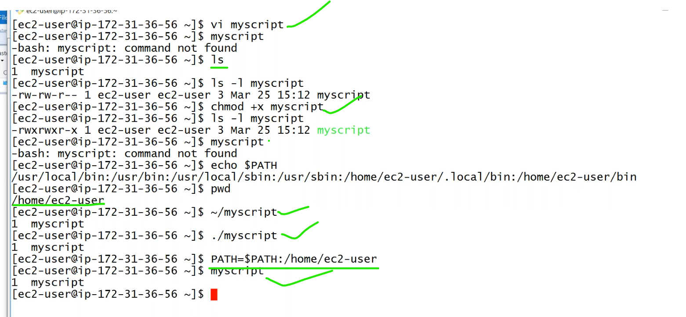
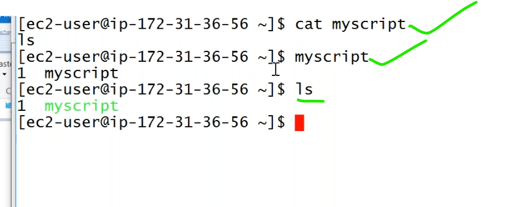


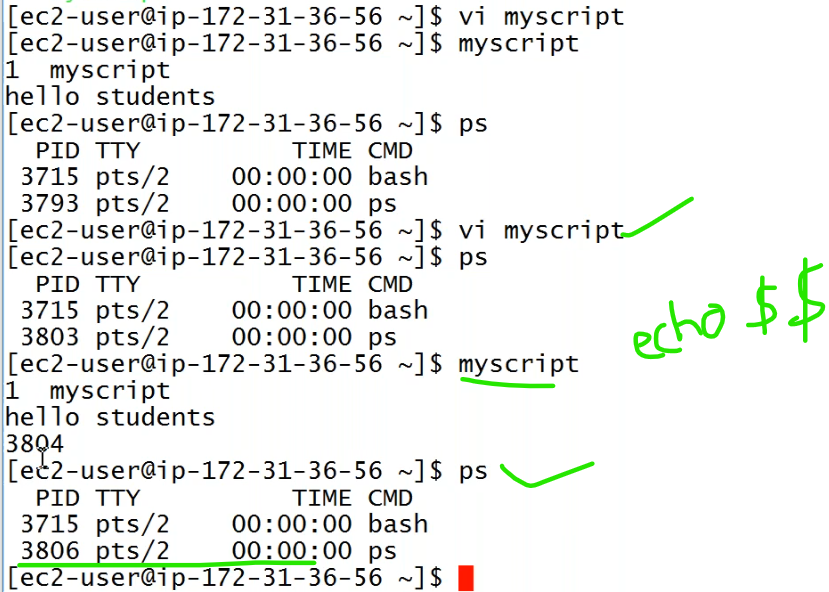
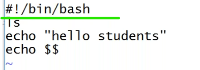
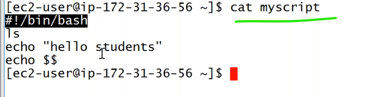

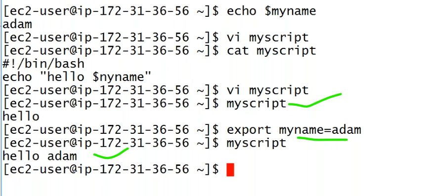

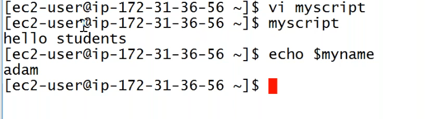

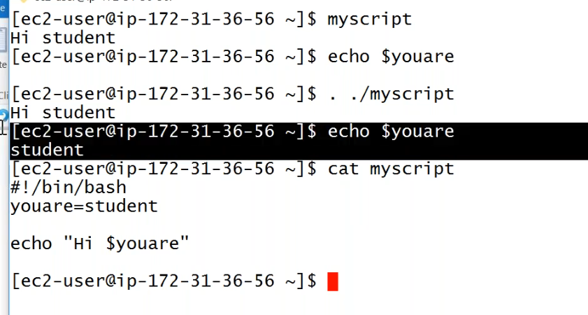
