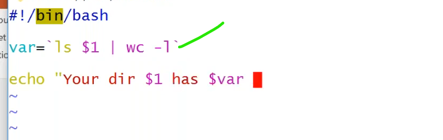
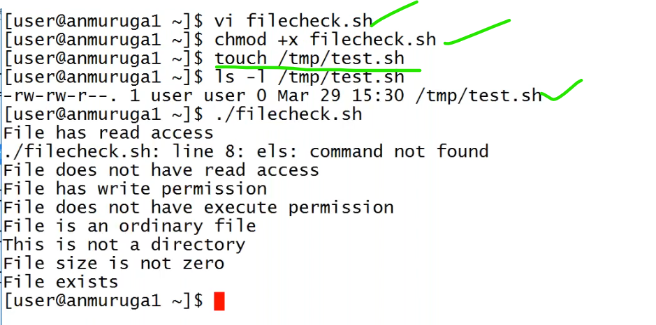
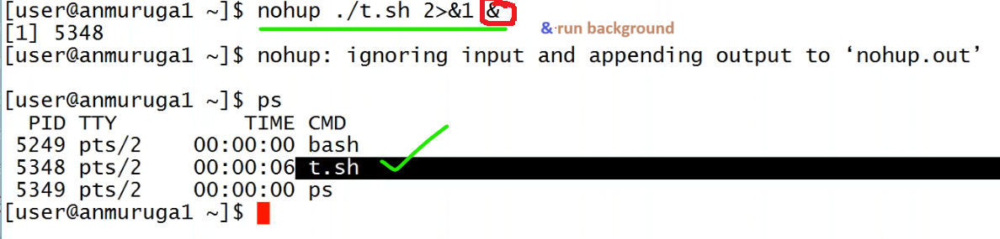
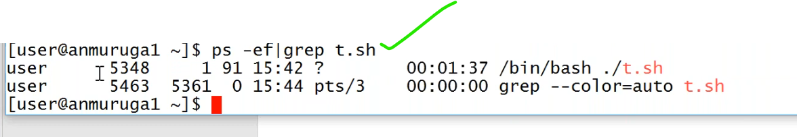

# Commandline arguments
----------------------------------------------
* we are taking the value from the user during runtime.if someone enter script manually pass the value again and again.in the automation cases `read` will not be used.
* to resolve this problem by `commandline arguments`.


#


#


#


#


#
* we can pass maximum of `9` values as arguments.
  
  
```
  What is the limit of arguments in shell script?
    Ans:The shell allows a command line to contain at least 128 arguments; however,
     a shell program is restricted to referencing only nine positional parameters,
     $1 through $9, at a given time.
     additional arguments can be accessed using the shift command or the $@ or $*  variables
```
# command substitution
--------------------------------------------------------------




# shell file test operators
-----------------------------------------------------------------


#


#




## Shell input/output redirection
-----------------------------------------------------------


#


# 


## nohup
--------------------------------------------------


 
 
* if we suddenly logout from computer/crashed/closed window/closed laptop/terminated.and again connected to the machine i do not see that script.
   

* if we want to run such script without disrupting we use `nohup`.
  
   
   
* if i close/terminated/shutdown script is still running.
  
* run the command to verify,
```
tail -f nohup.out
```



# `pkill -p pid`?

## vi editor
------------------------------------------------


# use cases of shell scripting
1. write script for stop and start the ec2 instance.
* `ans`:
* create file in the root folder to write a script `vi /root/.ec2instance_start.sh` 
```bash
#!/bin/bash
aws ec2 start-instances --instance-ids <instance-id>
```
* create a another file in root `vi /root/ec2instance_stop.sh`.
```bash
#! /bin/bash
aws ec2 stop-instances --instance-ids <instance-id>
```
* give executed permissions to both the files.
```
$ chmod +x /root/ec2instance_start.sh
$ chmod +x /root/ec2instance_stop.sh
```

