# Shell script

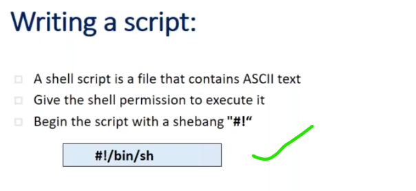

# varaibles
-----------------------------------------------------------------
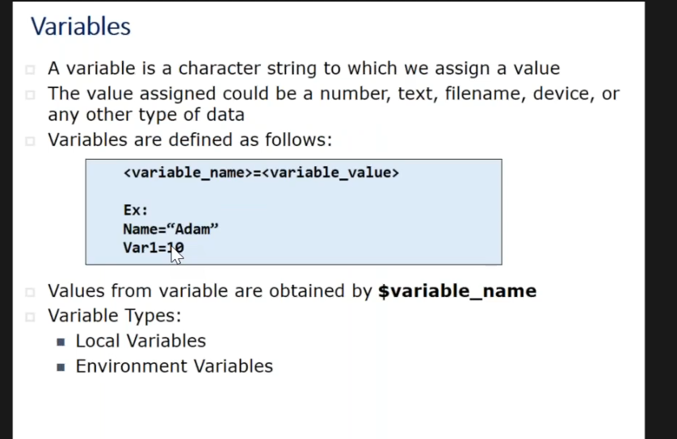
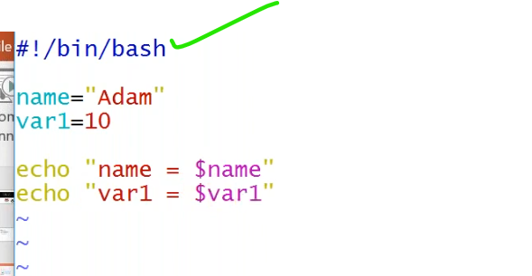
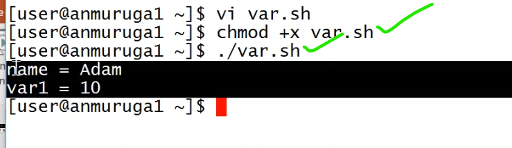

### `example`
--------------------------------------------

```bash
#!/bin/bash
myname="balu mahendra"
mycourse="aws devops"
institute="vtalent"
echo " my name is $myname, i am learning $mycourse in the $institute "
```
## Array variables
----------------------------------------------------
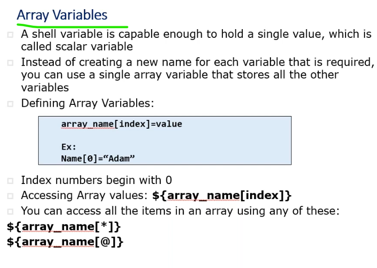
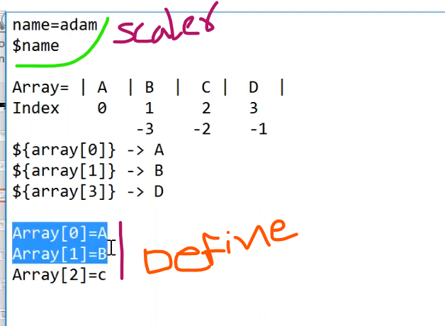


* vi array.sh
  
  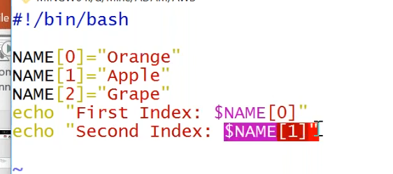
  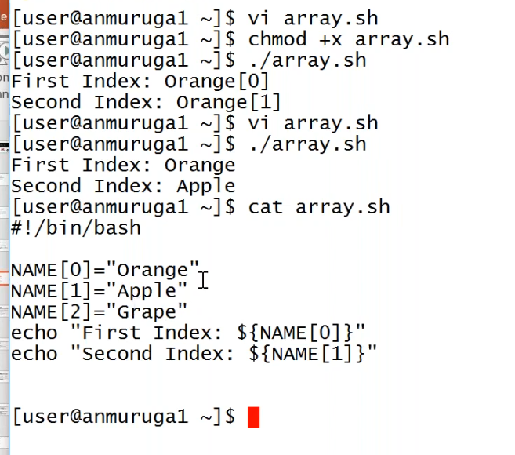
  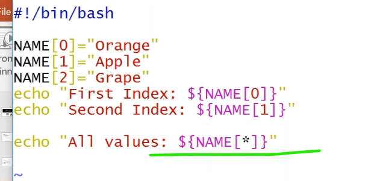
  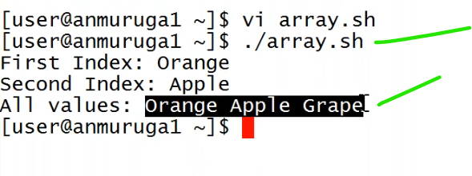

### `example1`
----------------------------------------
```bash
#!/bin/bash
TOOL[0]="git"
TOOL[1]="jenkins"
TOOL[2]="docker"
TOOL[3]="k8s"
TOOL[4]="ansible"
TOOL[5]="terraform"
echo " the vcs tool is ${TOOL[0]} "
echo " the containirazation tool ${TOOL[2]} "
echo " the container orchestration tool is ${TOOL[3]} "
echo " the IaaC tool is ${TOOL[5]} "
echo " the tools i was learned so far were ${TOOL[*]} " 
echo " the tools i was learned so far were ${TOOL[@]} " 
```


### array variable creation
----------------------------------------------------------------
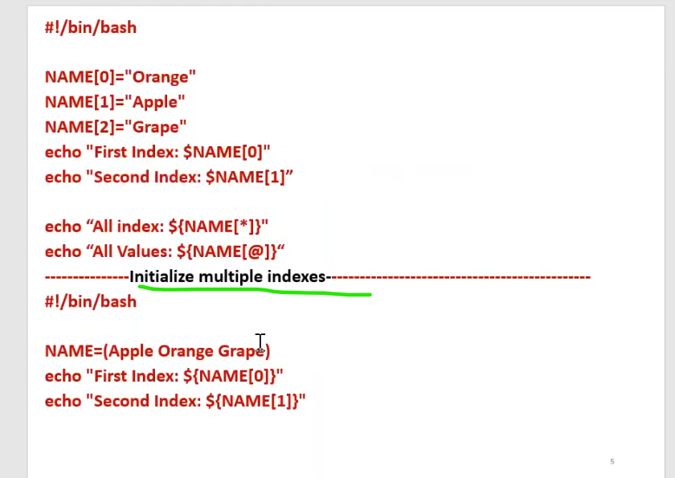
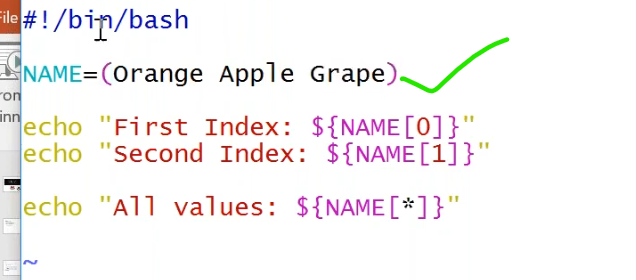
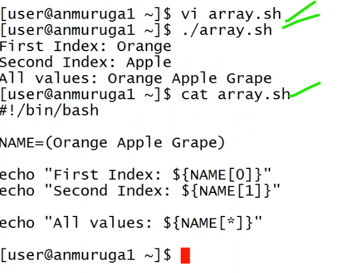


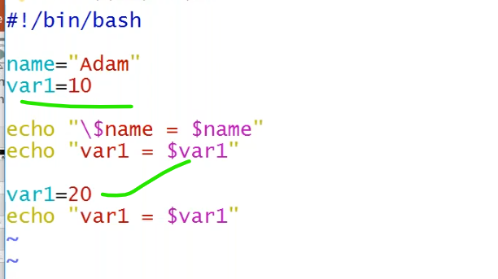
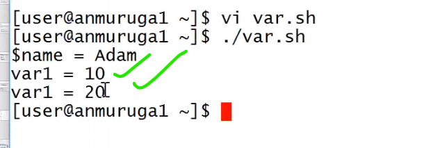

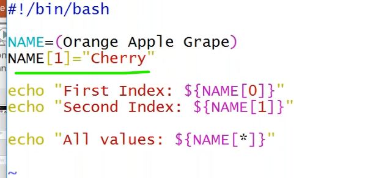
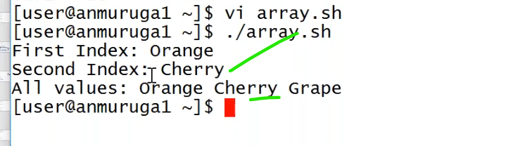

### `example1`
----------------------------------------
```bash
#!/bin/bash
devops_tools=(git jenkins maven docker k8s terraform ansible)
echo " the vcs tool is ${devops_tools[0]} "
echo " the configuration management tool is ${devops_tools[6]} "

```
### `example2`
```bash
#!/bin/bash
devops_tools=(git jenkins maven docker k8s terraform ansible)
devops_tools[1]="azuredevops"  ## change the values in the index.
echo " the vcs tool is ${devops_tools[0]} "
echo " the ci/cd tool is ${devops_tools[1]} "
echo " the configuration management tool is ${devops_tools[6]} "
echo " the devops tools are ${devops_tools[*]} "

```


  

## Negation or escasping
------------------------------------------------
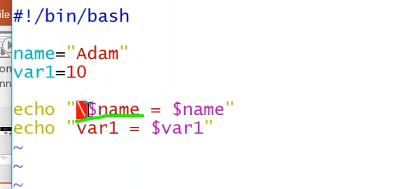
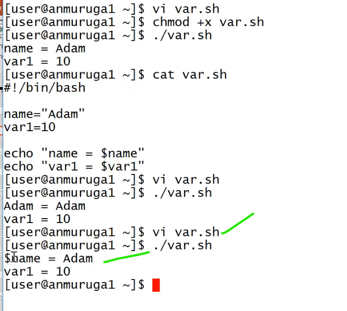

### `example1`
----------------------------------------------------
```bash
#!/bin/bash
name=balumahendra
value1=10
echo "\$name=$name"
echo "value1=$value1"

```
### `example2`
---------------------------------------------------------------------
```bash
#!/bin/bash
name=balumahendra
value1=10
echo "name=$name"
echo "\$value1=$value1"

```
