# operators
---------------------------------------------------
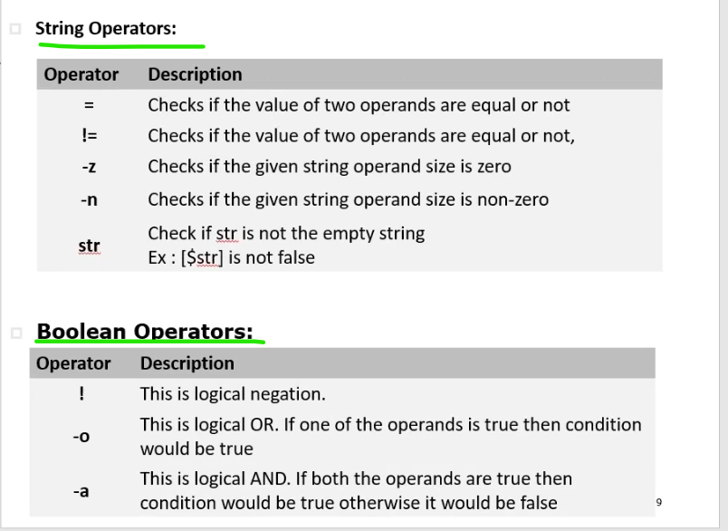

# conditional or Decision making
----------------------------------------------------------
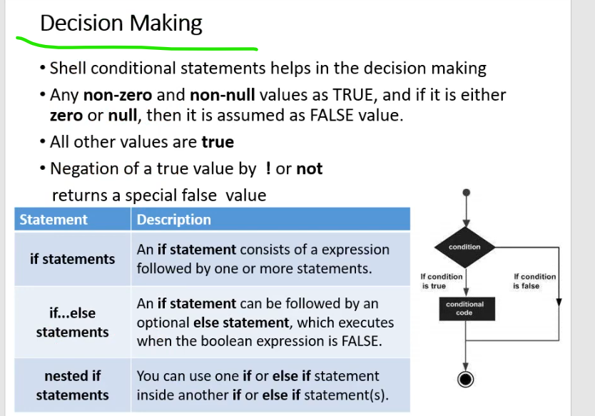

## IF Statement
-----------------------------------
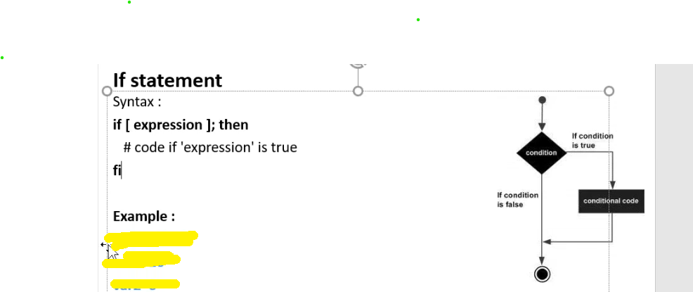
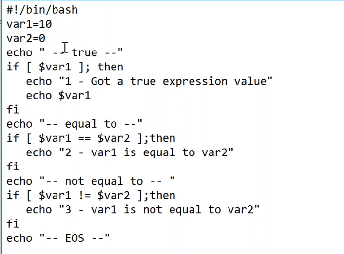
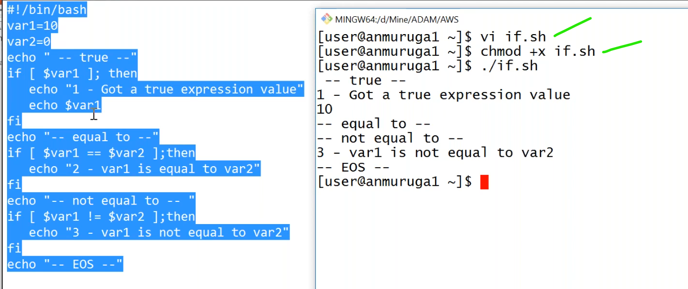

## IF ELSE Statement
----------------------------------------------------
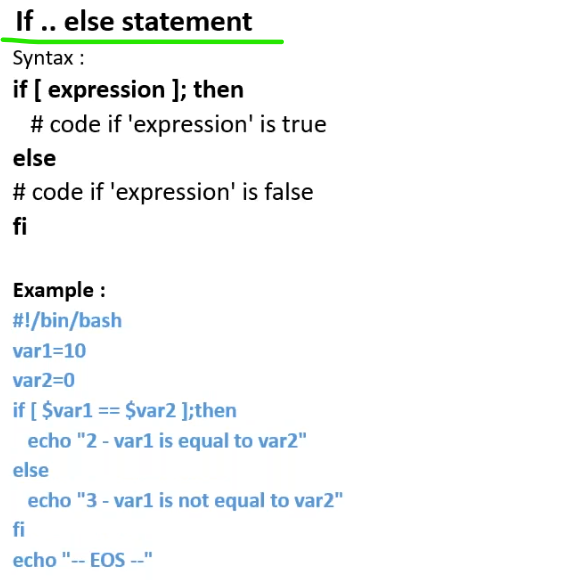
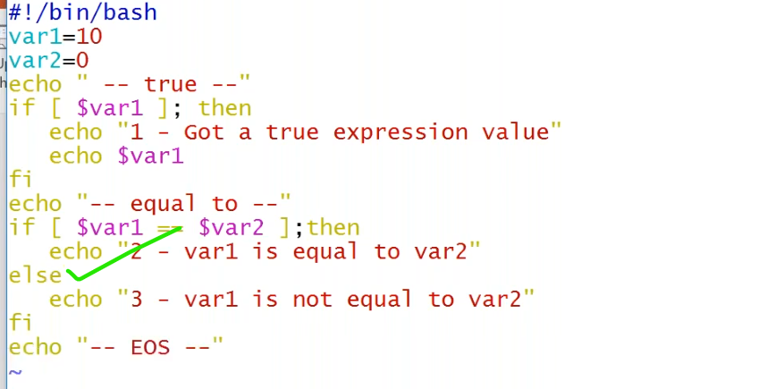
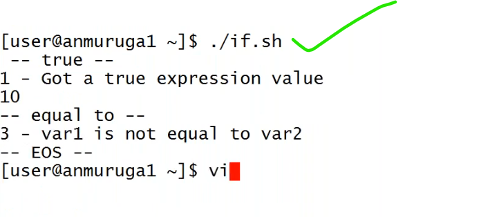
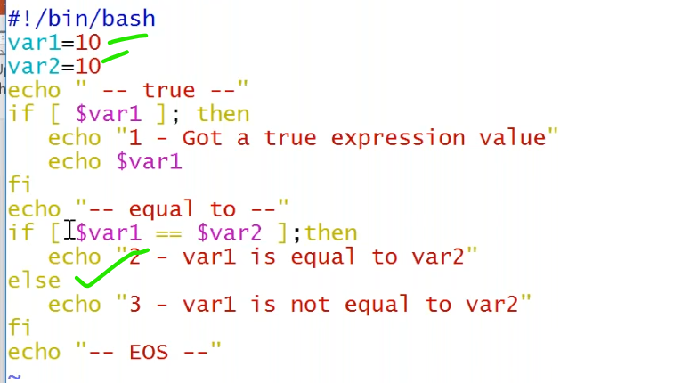
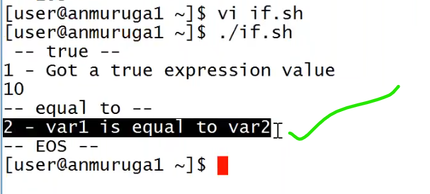

## ELIF Statement
---------------------------------------------------------
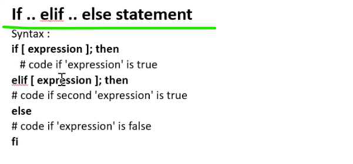
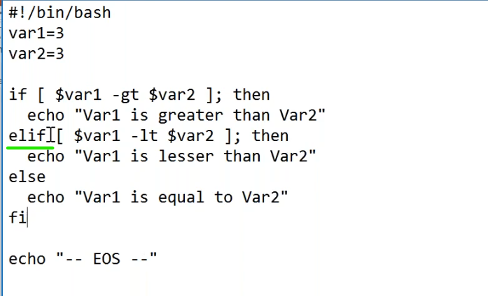
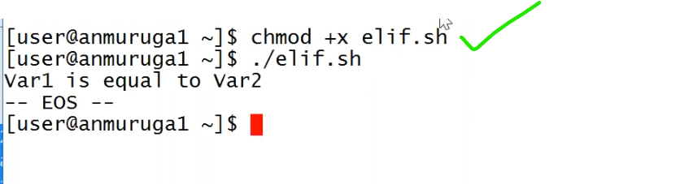
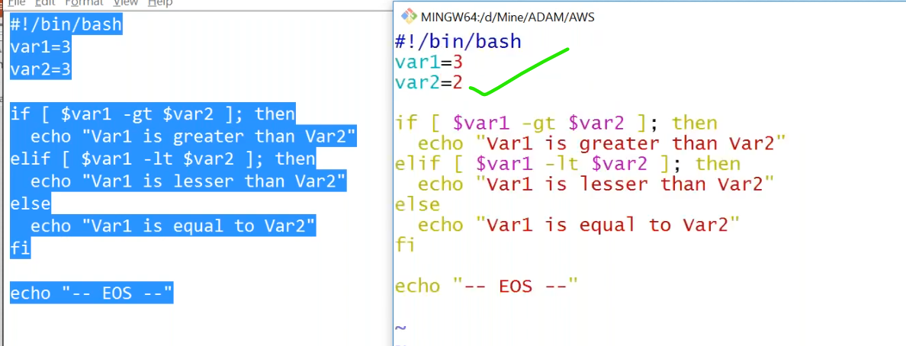
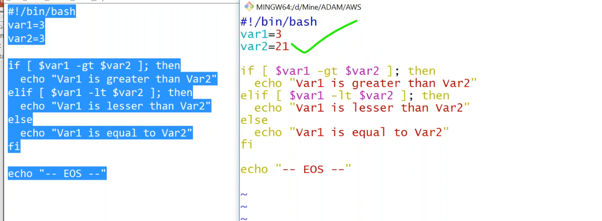
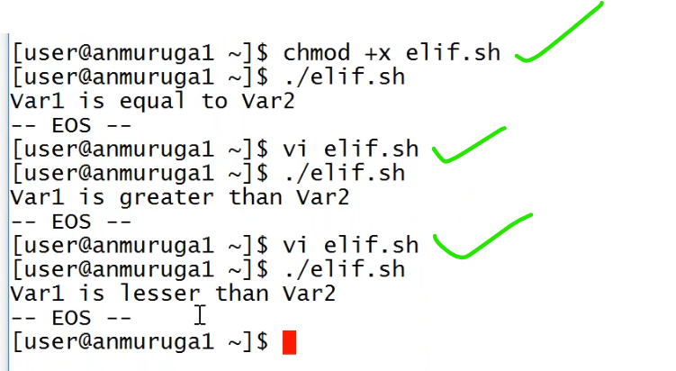
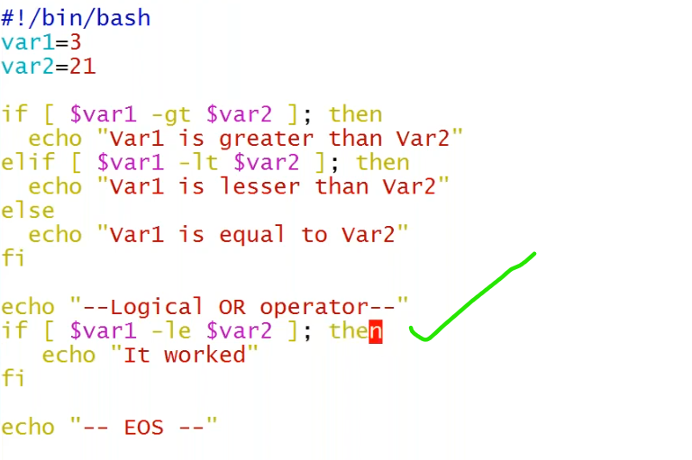
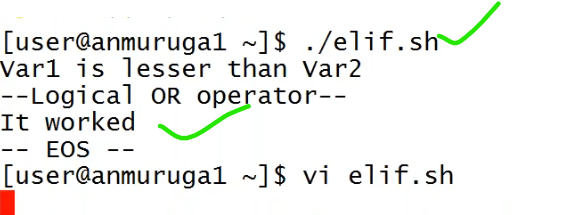

### string comparision
----------------------------------------------------
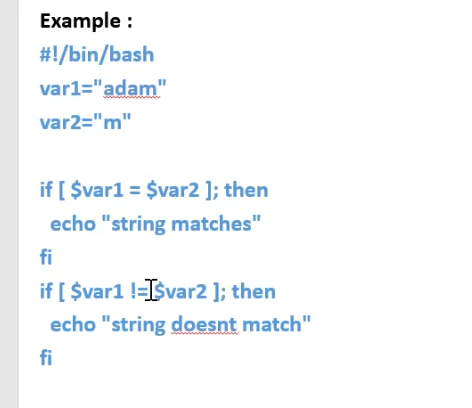
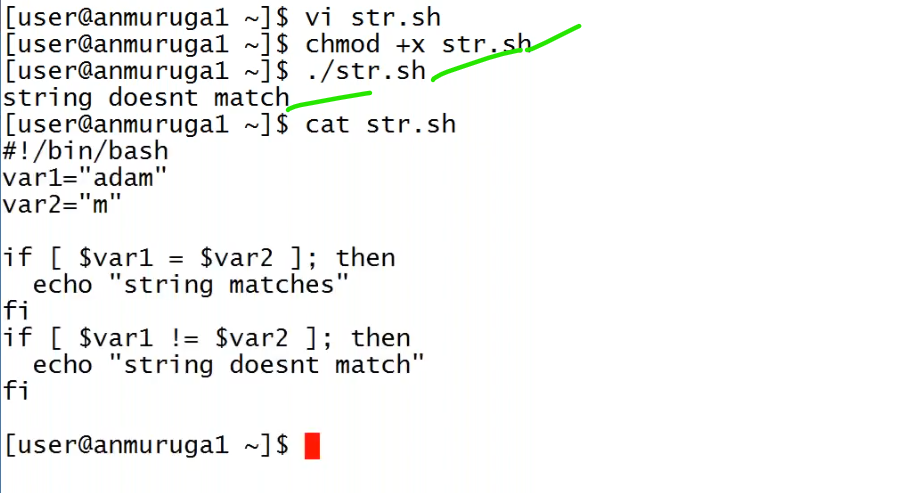

# Switch Statements
-------------------------------------------------------
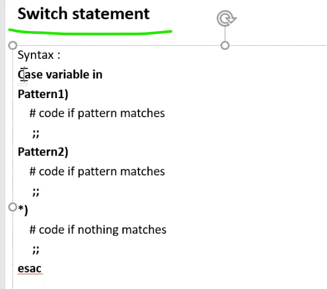
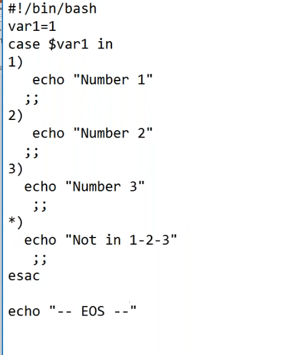
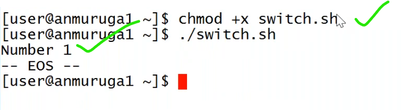
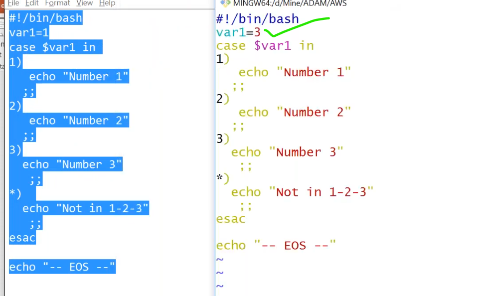
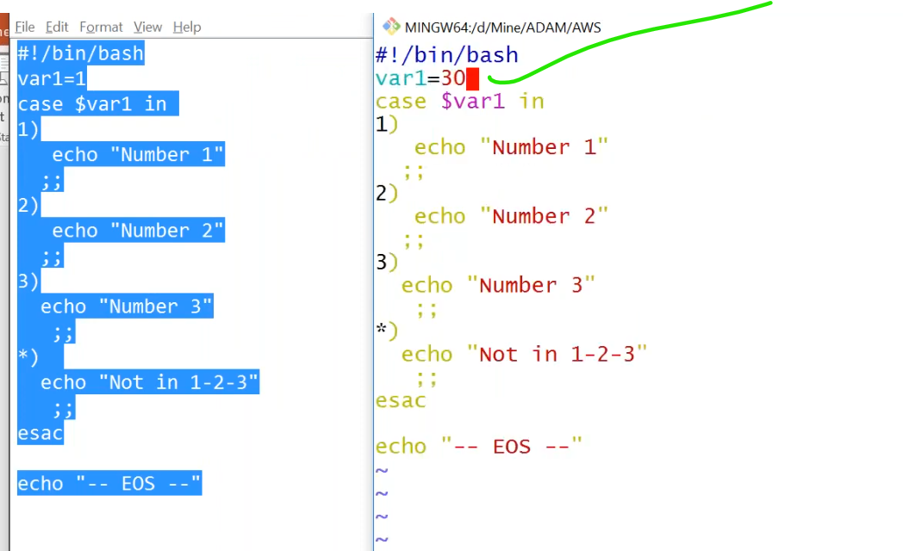
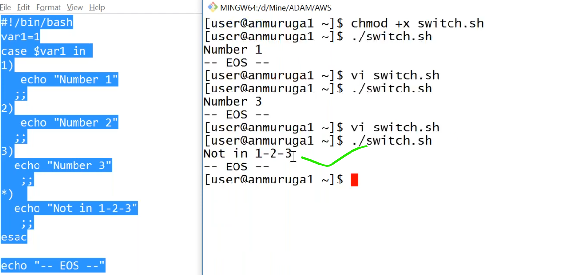

