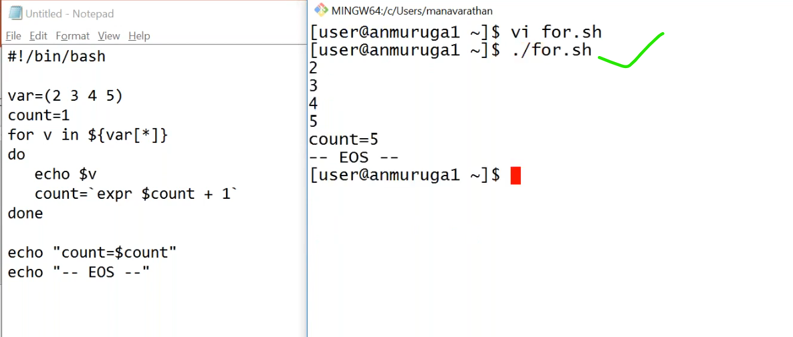

# Shell Loops
------------------------------------------------------------------------------
* Re Run same set of commands again and again.
* Loop is nothing but reapeating same line of commands again and again.
* each completion is called iteration.


## While loop
------------------------------


### `example1`
----------------------------------------------------
```bash
#!/bin/bash
count=0    # infinite loop
while [ $count -le 15 ]
do 
  echo " count=$count "
done
echo " ---EOS--- "
```
### `example2`
--------------------------------------------------------------------
```bash
#!/bin/bash
count=0
while [ $count -le 9 ]
do
  echo " count=$count "
  count=10
done
echo " ---EOS--- "
```
### `example3`
-------------------------------------------------------------------------
```bash
#!/bin/bash
count=0
while [ $count -le 15 ]
do 
  echo "count=$count"
  count=`expr $count + 1`
done
echo " ---EOS--- "
```
### `example4`
-----------------------------------------------------------------------
```bash
#!/bin/bash
count=25
while [ $count -ge 20 ]
do 
  echo "count=$count"
  count=`expr $count - 1`
done
echo "---EOS---"
```

## Untill loop
-----------------------------------------------------------
* the difference between `while` and `untill` is,
  * in while only when the condition is met then first time it is going to run.
  * untill means untill this condition is met you keep on doing it.
  * when we use while only fisrt time it goes for condition,but if we use untill first time it run and untill that condition is not met it going to keep on running it.
  


### `example1`
--------------------------------------------------------
```bash
#!/bin/bash
a=5
until [ $a -lt 5 ]   ## infinite loop untill condtion statisfy
do 
  echo "$a"
  a=`expr $a + 1`
done
echo "---EOS---"
```
### `example2`
------------------------------------------------------------
```bash
#!/bin/bash
a=5
until [ $a -lt 10 ]   ## untill condtion statisfy
do 
  echo "$a"
  a=`expr $a + 1`
done
echo "---EOS---"
```
### `example3`
------------------------------------------------------------------------------
```bash
#!/bin/bash
a=1
until [ $a -gt 10 ]   ## untill condtion statisfy
do 
  echo "$a"
  a=`expr $a + 1`
done
echo "---EOS---"
```


## For loop
------------------------------------------------------------
* if we have the condition,untill the condition is matched or while the condition is matched we use these untill and while.
* sometimes will not be knowing condition we have a value and depending upon how many values u have that many times u want to happen.


### `example`
-------------------------------------------------------------------------------------
```bash
#!/bin/bash
values=(2 4 5 6 7)
for v in ${values[*]}
do
  echo $v
done
echo "---EOS---"
```

## using  a for loop how can i findout average?




### `example1`
----------------------------------------------------------
```bash
#!/bin/bash
values=(3 4 6 8 7)
count=1
for v in ${values[*]}
do
  echo $v
  count=`expr $count + 1`
done
  echo "count=$count" # number of numbers
echo "---EOS---"
```
### `example2`
----------------------------------------------------------
```bash
#!/bin/bash
values=(3 4 5 6 7 8)
count=1
for v in ${values[*]}
do
  echo "count inside loop $count"
  echo $v
  count=`expr $count + 1`
  echo "count after increment $count"
done
count=$count
echo "---EOS---"
```
### `example3`
-----------------------------------------------------------
```bash
#!/bin/bash
values=(3 4 5 6 7 8 9)
count=0
total=0
for v in ${values[*]}
do
  echo "count inside loop $count"
  total=`expr $total + $v`
  count=`expr $count + 1`
  echo "count after increment $count"
done
echo "total=$total"
echo "count=$count"
avg=`expr $total / $count`
echo " the average of $v are $avg "
echo "---EOS---"
```

