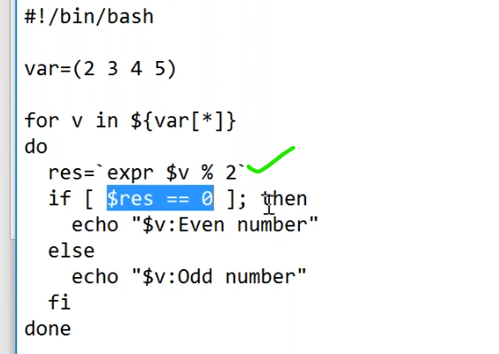
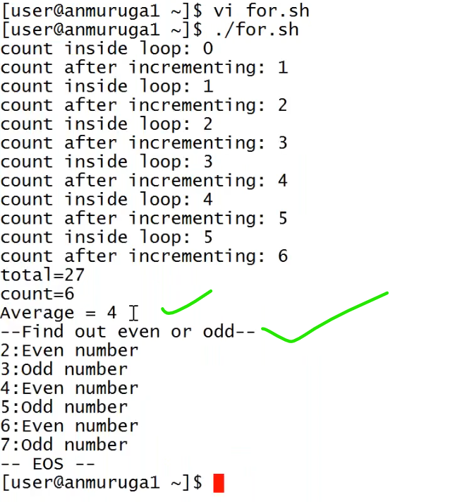
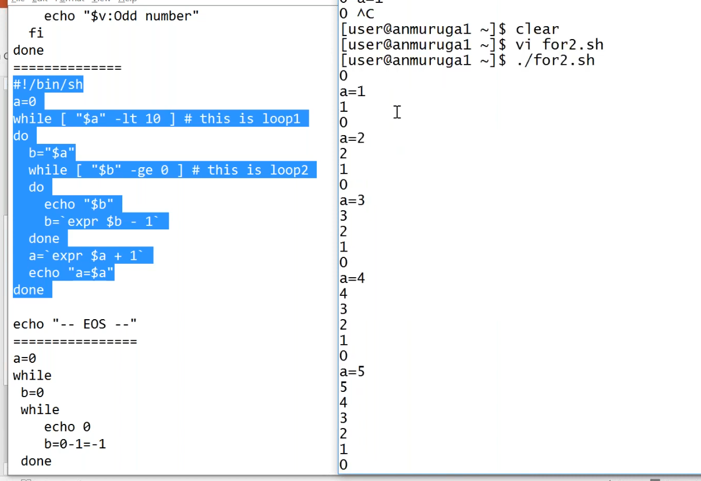
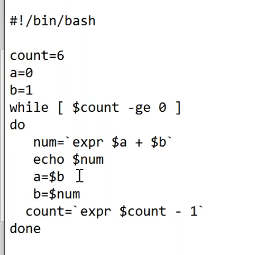
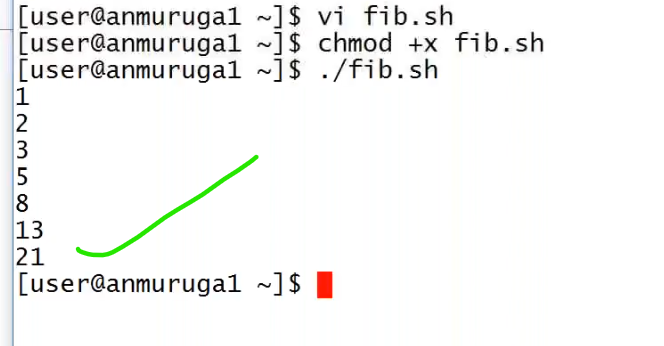
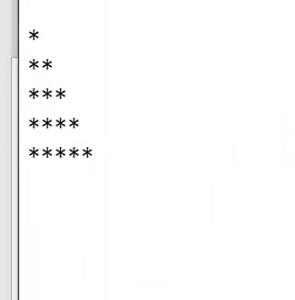

# for loop
-------------------------------------------------
## even or odd number
---------------------------------------------------


### Example1
--------------------------------------------------
* even or odd number using for loop.
```bash
#!/bin/bash
values=(2 3 4 5 9 13 16 25 29)
for i in ${values[*]}
do
result=`expr $i % 2`
if [ $result == 0]; then
   echo " the number $i is even "
else
   echo " the number $i is odd "
fi
echo "print the each value #i"
done 
```

## loop inside a loop
----------------------------------------------------------------------


### Example1
-------------------------------------------------
* example on loop inside loop.
```bash
#!/bin/bash
a=5
while [ ${a} -le 10 ] ## loop1
do
  b="$a"
  while [ ${b} -ge 0 ] ## loop2
  do
    echo "$b"
    b=`expr $b - 1`
  done
  a=`expr $a + 1`
  echo "a=$a"
done

```
### Example2
-------------------------------------------------
* example on loop inside loop.
```bash
#!/bin/bash
a=0
while [ ${a} -le 10 ] ## loop1
do
  b="$a"
  while [ ${b} -ge 0 ] ## loop2
  do
    echo "$b"
    b=`expr $b - 1`
    echo " print each iteration of $b "
  done
  echo "a=$a"
  a=`expr $a + 1`
  echo "print each iteration of $a"
done
```
### febonoic series
------------------------------------------------------------



### Example1
-------------------------------------------------
* febonic series.
```bash
#!/bin/bash
count=5
a=1
b=2
c=3
while [ $count -ge 0 ] 
do 
     num=`expr $a + $b + $c`
     echo "$num"
     a=$b
     b=$c
     c=$num
     count=`expr $count - 1`
done
```

## excersice
---------------------------------------------------------------


### Example1
--------------------------------------------------
```bash
#!/bin/bash
count=5
i=0
j=0

while [ $i -le `expr ${count} - 1` ]
do
	j=0
	
	while [ $j -le `expr ${count} - 1` ]
	do
		if [ `expr ${count} - 1` -le `expr $i + $j` ]
		then
		echo -ne "*"  # Print the pattern
		else
		echo -ne ""   # Print the spaces required
		fi
		j=`expr $j + 1`
	done
	echo # For next line
			
	i=`expr $i + 1`
done
```
### Example2
--------------------------------------------------
```bash
#!/bin/bash
count=5
i=0
j=0

while [ $i -le `expr ${count} - 1` ]
do
	j=0
	
	while [ $j -le `expr ${count} - 1` ]
	do
		if [ `expr ${count} - 1` -le `expr $i + $j` ]
		then
		echo -ne "*"  # Print the pattern
		else
		echo -ne ""
        echo "print spaces of `expr $i + $j`"   # Print the spaces required
		fi
		j=`expr $j + 1`
	done
	echo # For next line
			
	i=`expr $i + 1`
    echo "print the value of i is $i"
done
```