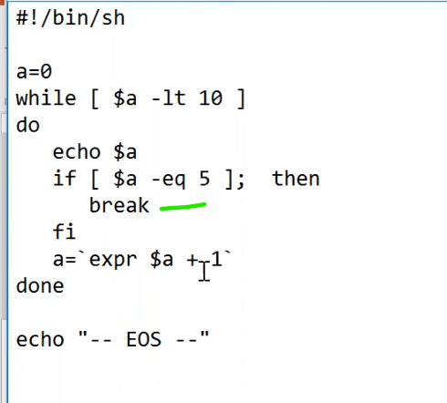

# Loop control
----------------------------------------------------------------
## Break
------------------------------------------------------------

## continue
------------------------------------------------------------

