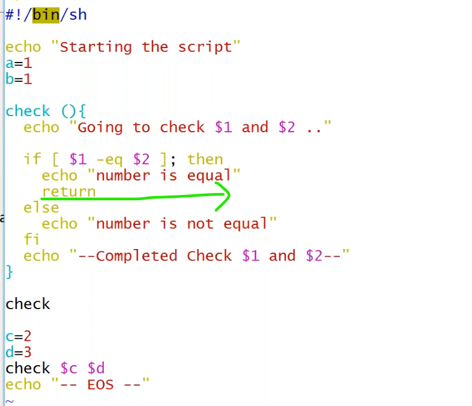
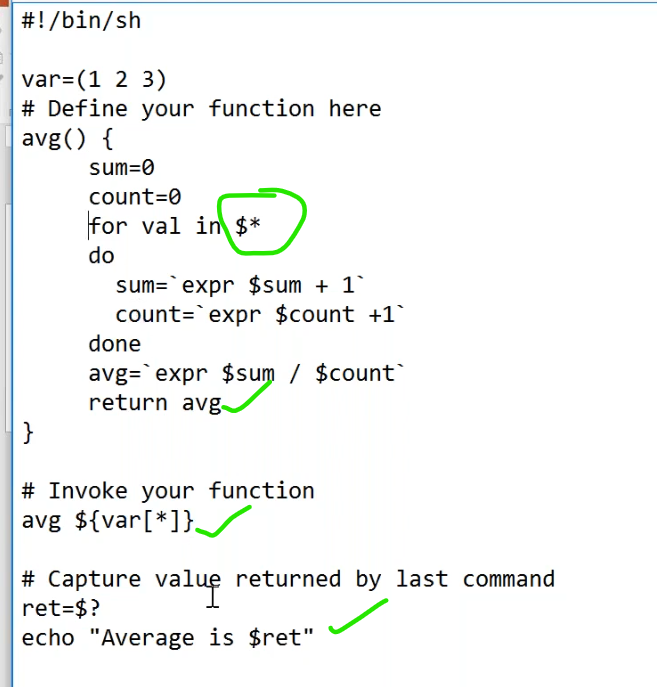
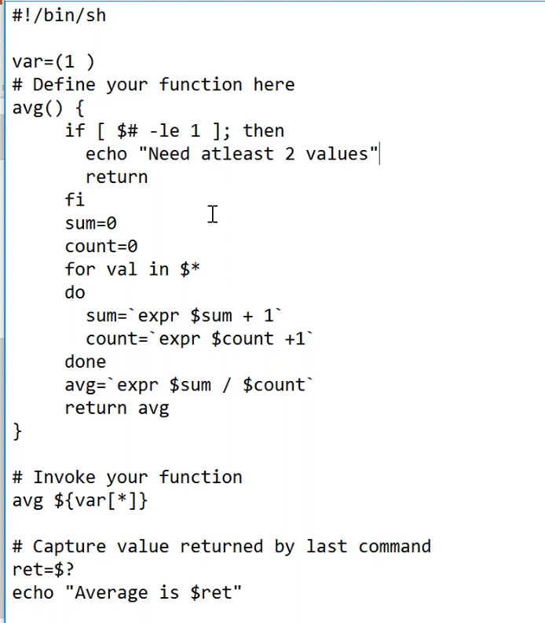

# Shell Functions
-----------------------------------------------------------------------

* `echo` is a built in function.
## usage of functions
----------------------------------------------------------------------

### parameters to function
------------------------------------------------

* `$1` and `$2` only available in within this function.

### return values of function
-------------------------------------------------------------------
* function bydefault `returns`,when we want to return from specific line then use `return`.

  
* without `return`.

* with `return`.
  

* to strore the return value of a function,

### `return` example.
--------------------------------------------------

### speciel variables
-------------------------------------------------------------

