# Nested Functions
----------------------------------------------------------------------------
* function inside a function.
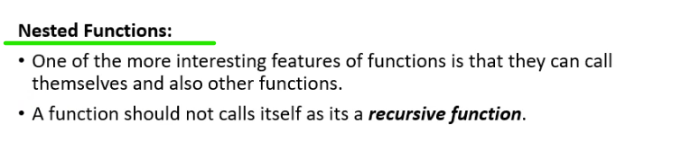
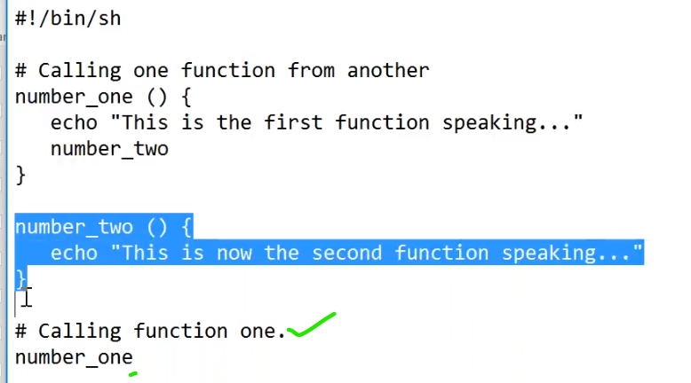

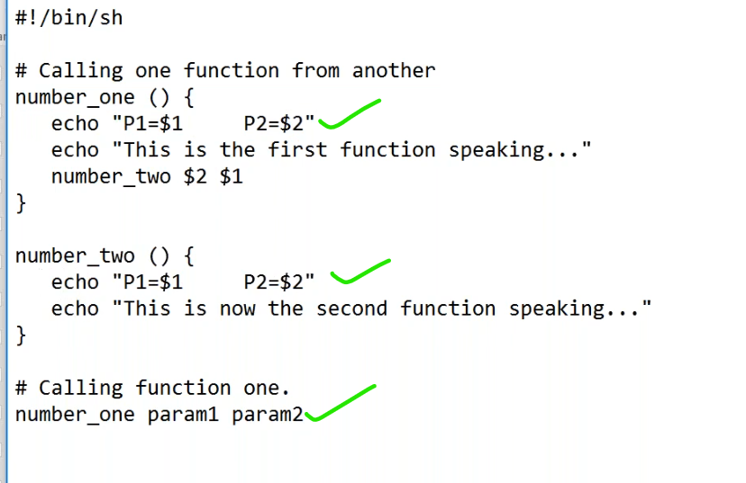
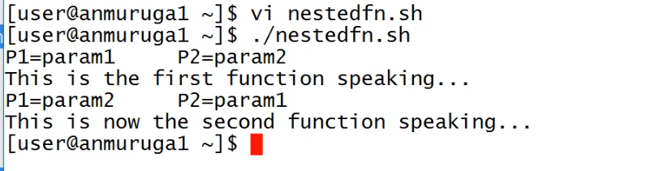

* Any thing u defined varianble in main function it should be available to all functions.

* anything u defined inside the function it is specific to that function only.
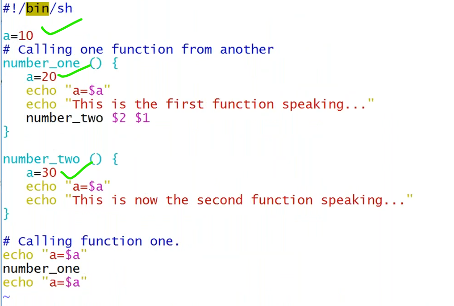
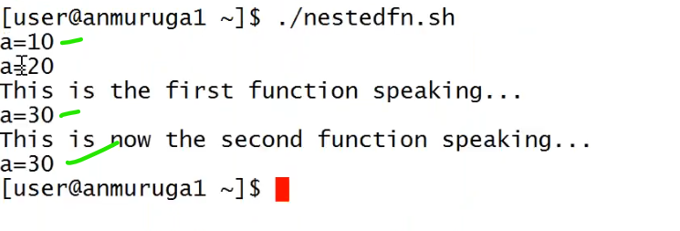

# Read functions
-------------------------------------------------------------------------
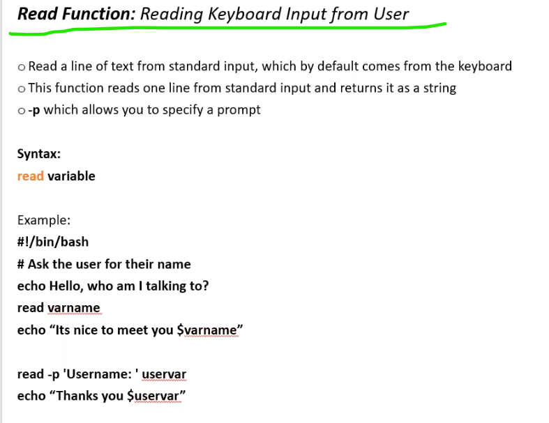
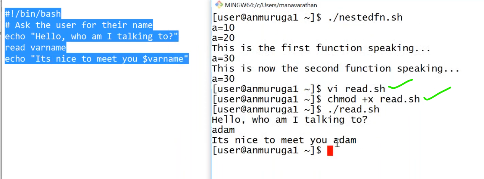

## `basename` (Command)
--------------------------------------------------
* it gives the last folder or file.

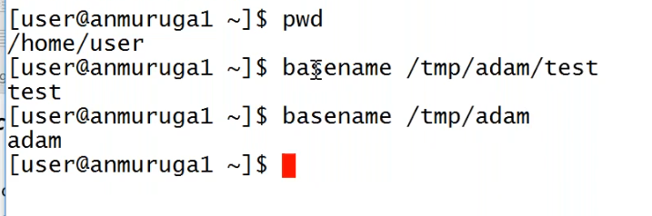

## calculating average 
-----------------------------------------
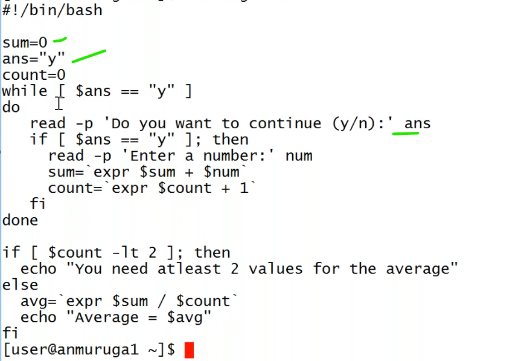
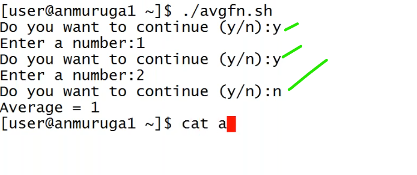

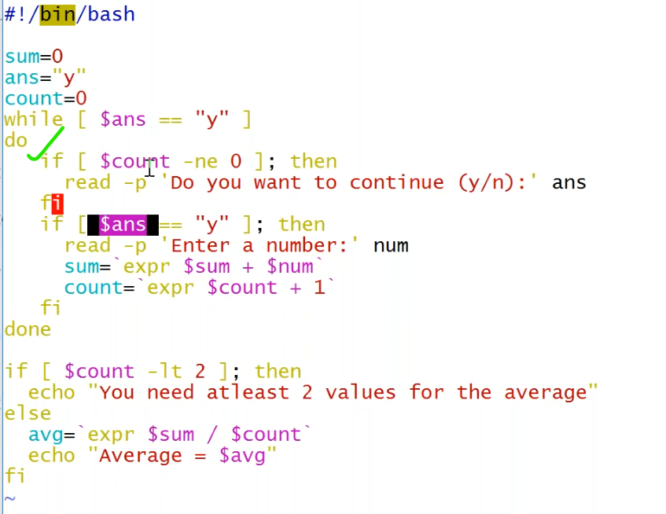
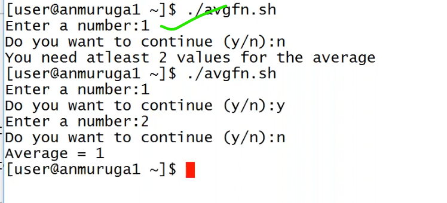

