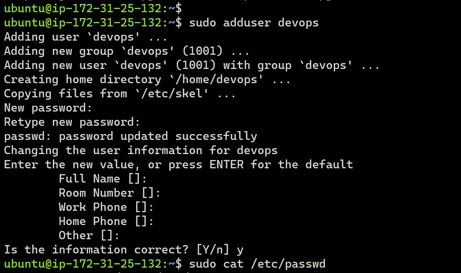
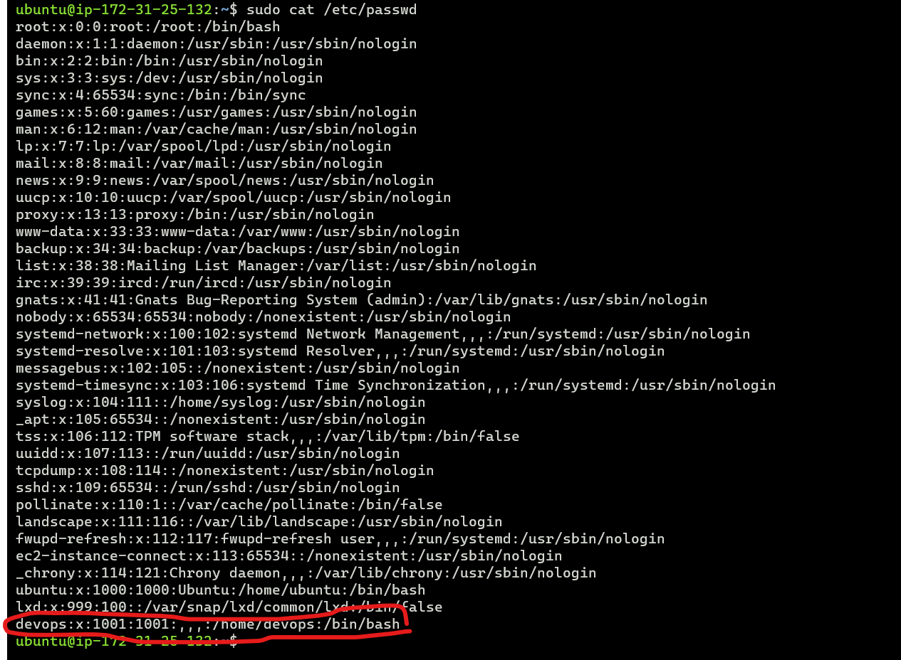
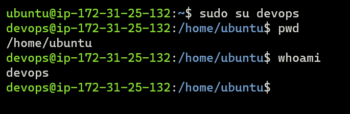
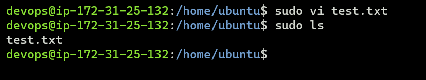
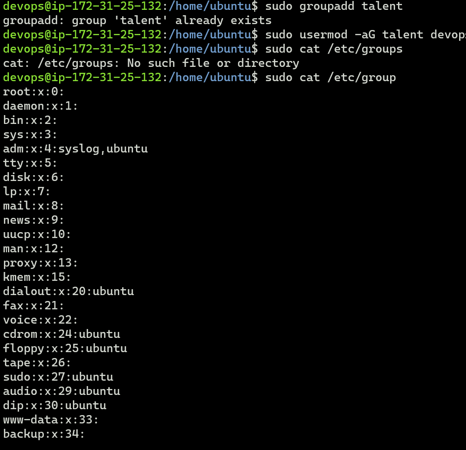
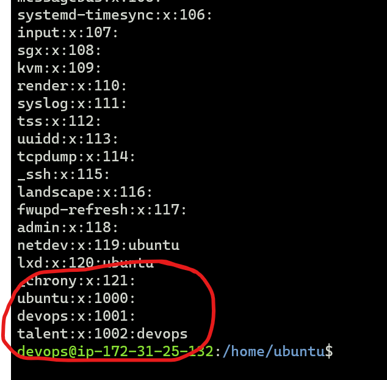

### Task 1:
------------------
  a. create a user "devops" and verify whether its created or not.

  b.  switch to user devops.

  c. create a file "test.txt" in the devops home directory
 

  d.  Create a group "talent"
  e. add devops user in the group "talent"
  f. verify whether user is added correctly in group.

  
