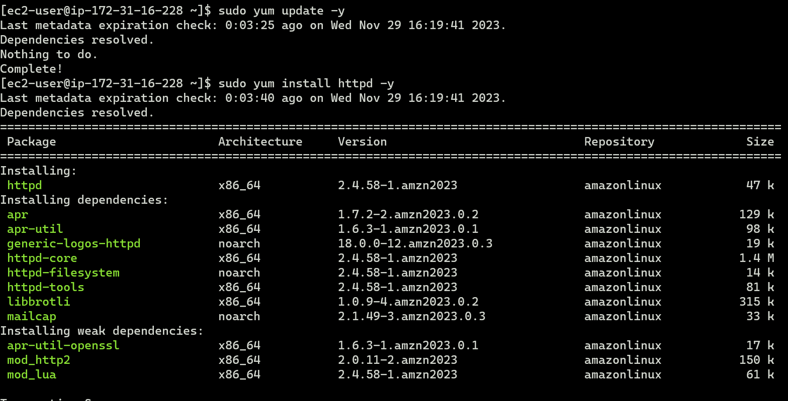
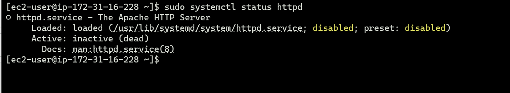
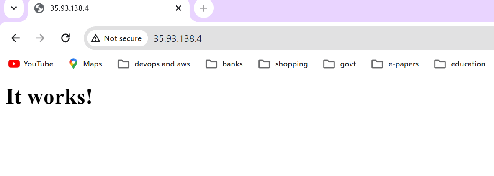
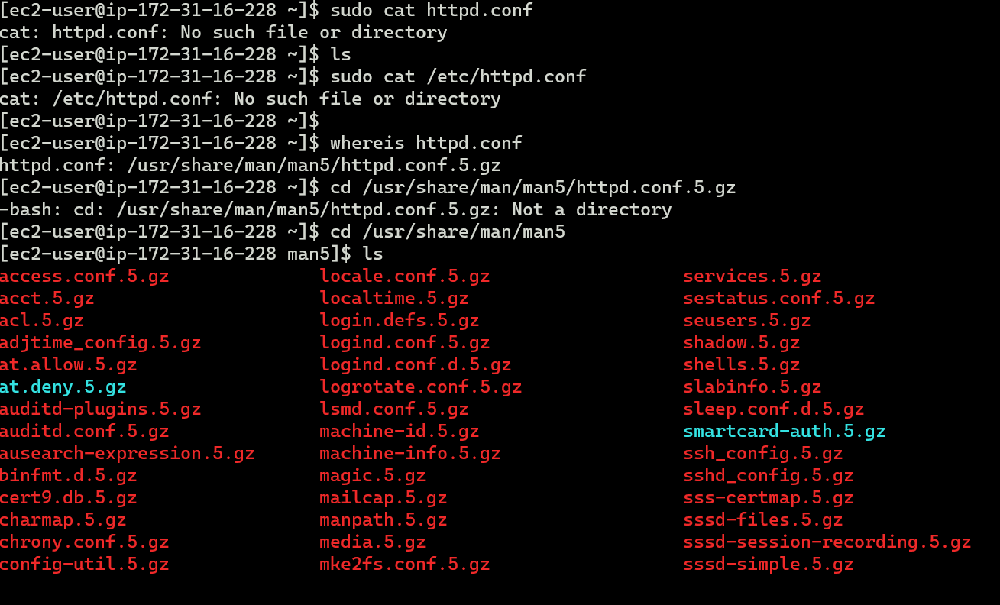
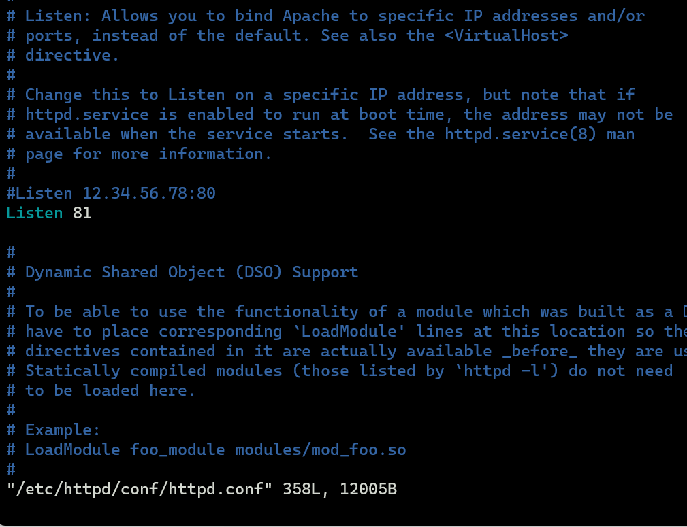
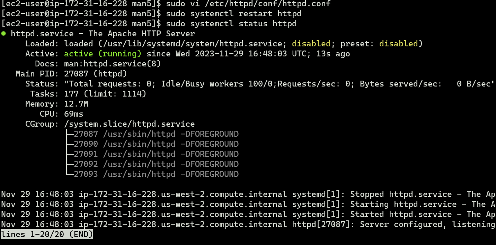
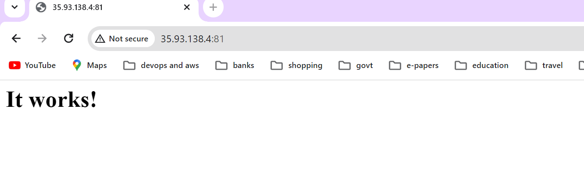
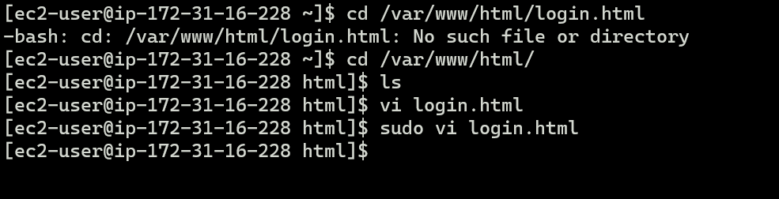
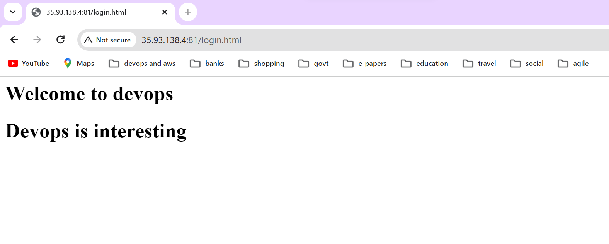

## task2
-----------
    a. Install the httpd server in amazon linux.

	b. Check the status of httpd

	c. Start the httpd service

	d. Check httpd is accessible from browser.

	e. Change the httpd port from 80 to 81 in httpd.conf file.

	f. Restart the httpd

	g. Access the httpd from browser

	h. Create a login.html file in /var/www/html/ folder with below content.

	<html>
	  <h1> Welcome to devops </h1>
	 <h1> Devops is interesting</h1>
	</html>

   i. access the login.html file from browser.

