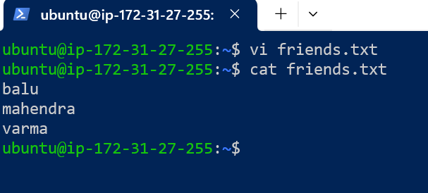
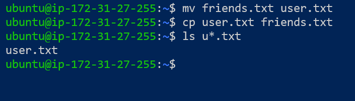
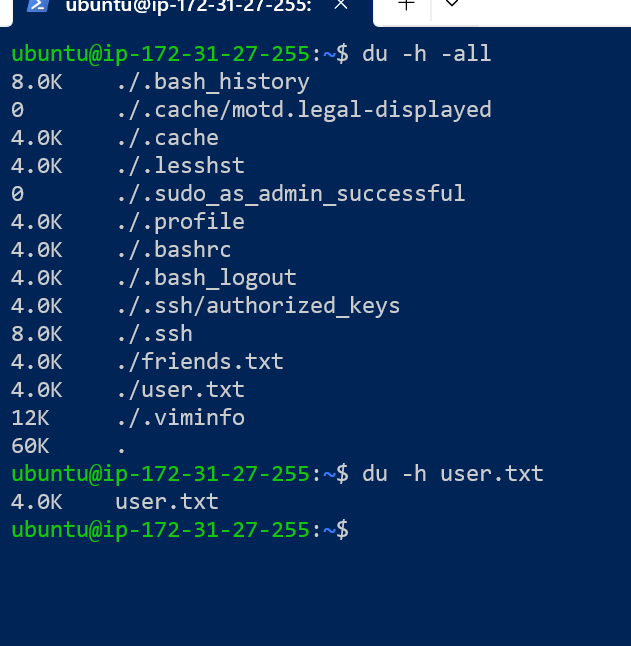
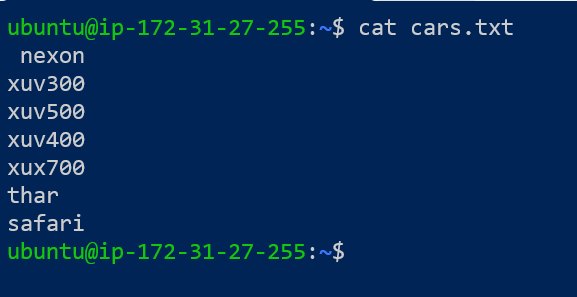
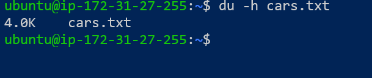
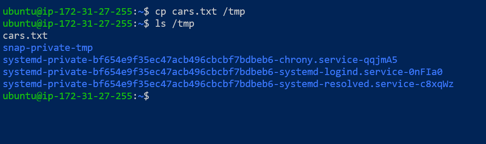
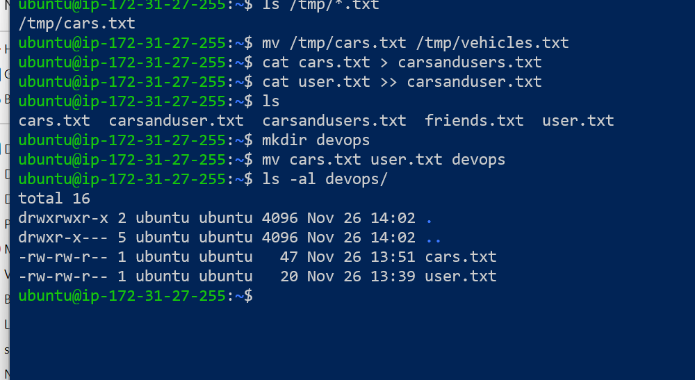
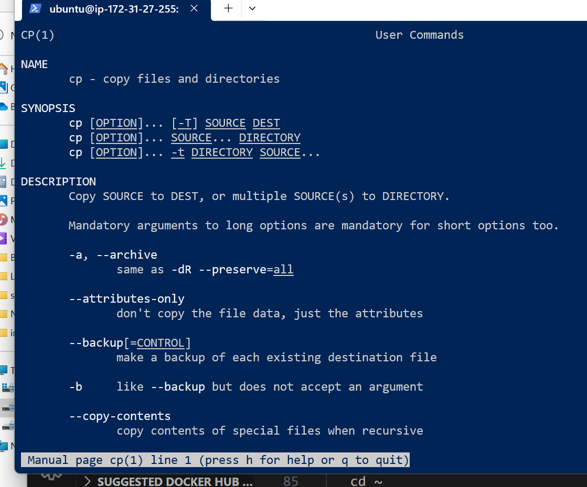
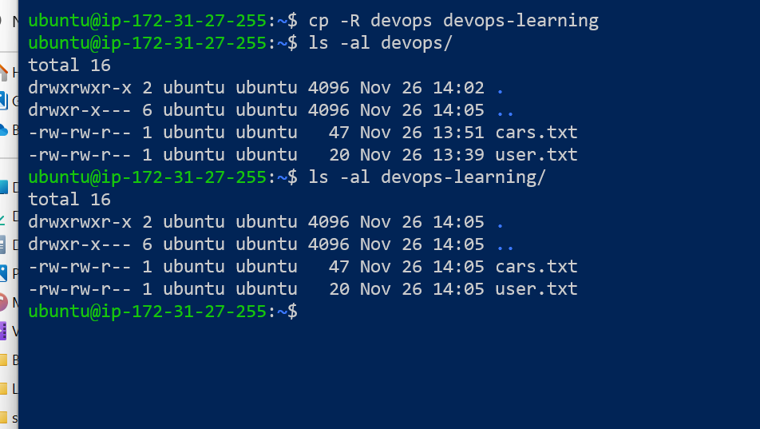

### linux tasks
---------------
1. Create file with friends.txt with list of name of 3 friends on seperate lines.
``````
  vi friends.txt
`````` 

2.Display the content of the friends.txt on the console.
   

3.Rename friends.txt to users.txt
``````
  mv friends.txt user.txt
``````

4.make a copy of the friends.txt under user.txt
``````
 cp user.txt friends.txt
``````
 
5.List all the files whose names begin with letter u and and ends with extension txt


6.check how many bytes are taken up by the files.


7.create a file cars.txt with a list of brands of cars on seperate lines.
``````
  vi cars.txt
``````
    
8.check how many bytes are taken up by the file 'cars.txt'
``````
  du -h cars.txt
``````



9.copy the file cars.txt to /tmp directory
``````
  cp cars.txt /tmp
``````


10.list all the files with extension *.txt in directory /tmp and verify that the file copied properly.


11.without leaving your home directory rename file cars.txt to located in /tmp to vehicles.txt in /tmp
``````
   mv /tmp/cars.txt /tmp/vehicles.txt
``````
   
12.concatenate the contents of a files 'cars.txt' and user.txt into file 'carsandusers.txt'
``````
   cat cars.txt > carsandusers.txt
   cat user.txt >> carsanduser.txt
``````

13.create directory  "devops"
``````
   mkdir devops
``````
  
14.move files cars.txt and user.txt into directory "devops"
``````
  mv cars.txt user.txt devops
`````` 
15.list contents of "devops" directory in details
   

  
16.search the web or use manual page by issuing : man cp on how to copy a directory with all its contents

    
17.In one command copy of directory 'devops' and its all content under the name 'devops-learning'
``````
  cp -R devops devops-learning
``````
          
18.list the content of a 'devops' and 'devops-learning' directories in two seperate commands to verify copying was sucessful.


   
19.how to you get into home folder from anywhere?
``````
   cd ~
``````
	
20.change the directory to '/etc' but using RELATIVE path in only in one command
``````
  cd etc/
``````
	
21.Display the content of a 'passwd' file on the screen
``````
   cat /etc/passwd
   less /etc/passwd
``````
      
22.Display the content of a 'passwd' file on the screen interactively(So you can search,scroll up and down)
   vi /etc/passwd  or
   less /etc/passwd
      
23.Change the directory to /var/log but using RELATIVE path only in one command assuming you are in /etc directory
``````
   cd ../var/log
``````   	
24.Display the content of 'messages' or 'syslog' file on the screen interactively(So you can search,scroll up and down)
``````
  less syslog or
  vi syslog
``````
	
25.copy the file 'messages' to your home directory under the name 'systemlog.txt' using path relative to the home directory in one command
``````
 - first make sudo user by- sudo -i
 - cd /var/log
 - cat syslog > systemlog.txt
 - exit from sudo user
 - cp systemlog.txt ~
 ``````
        