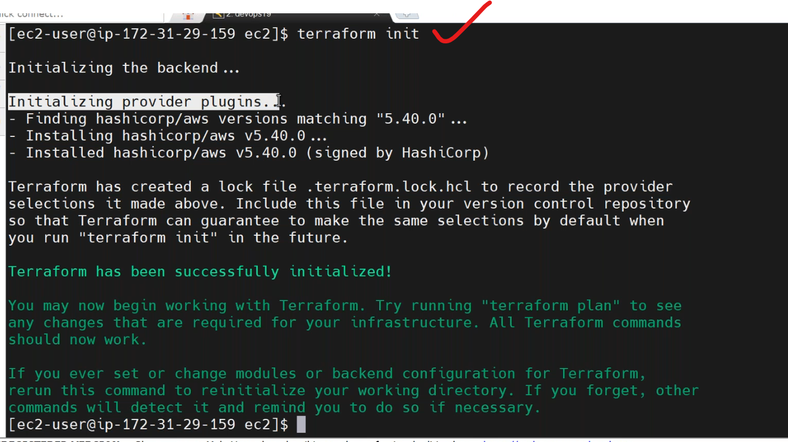
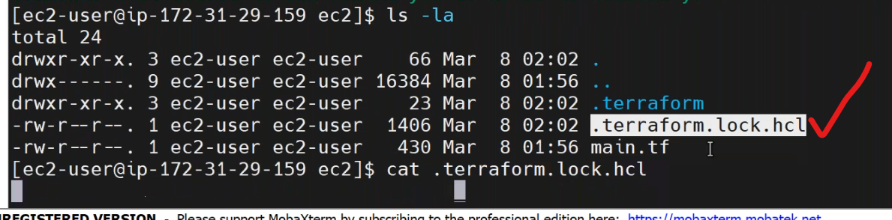
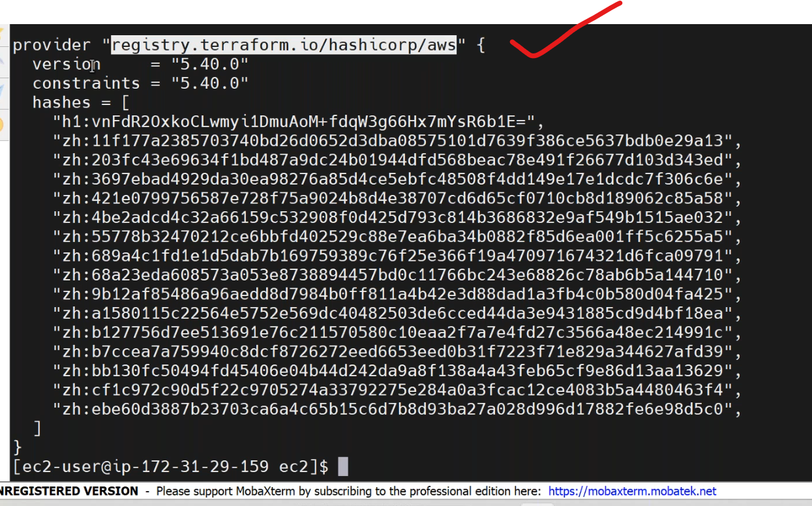
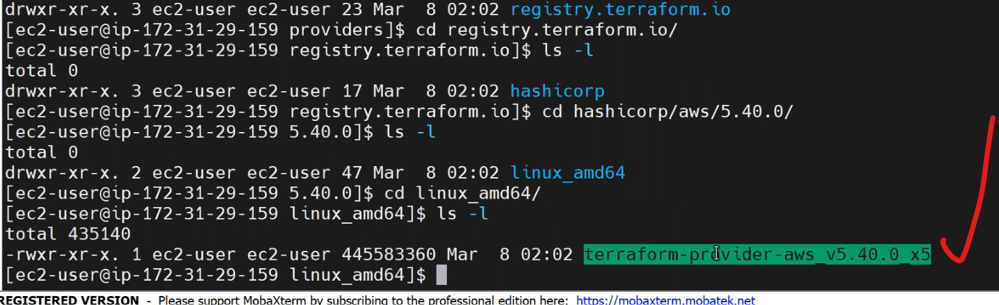
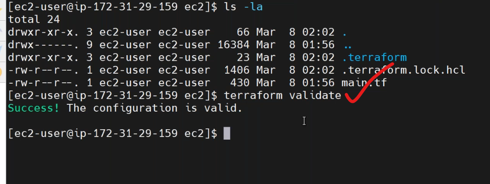
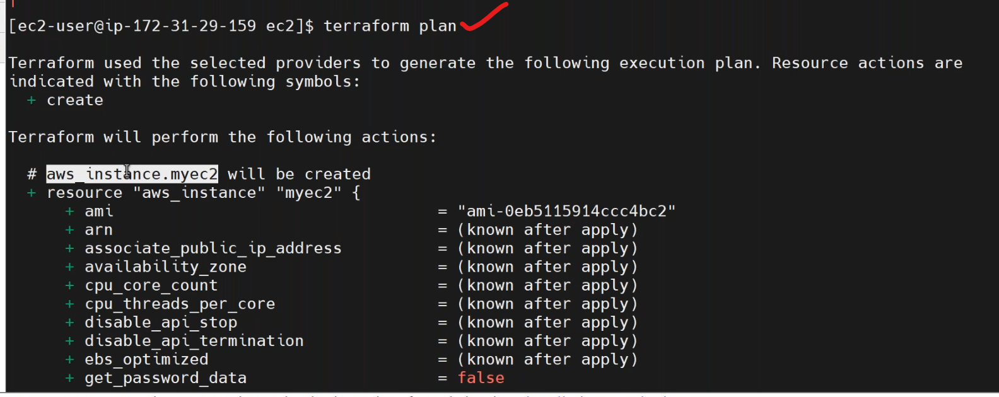
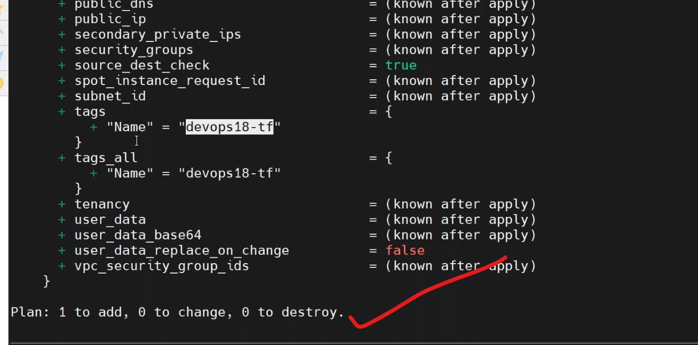
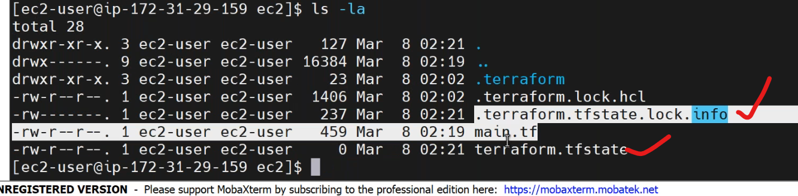
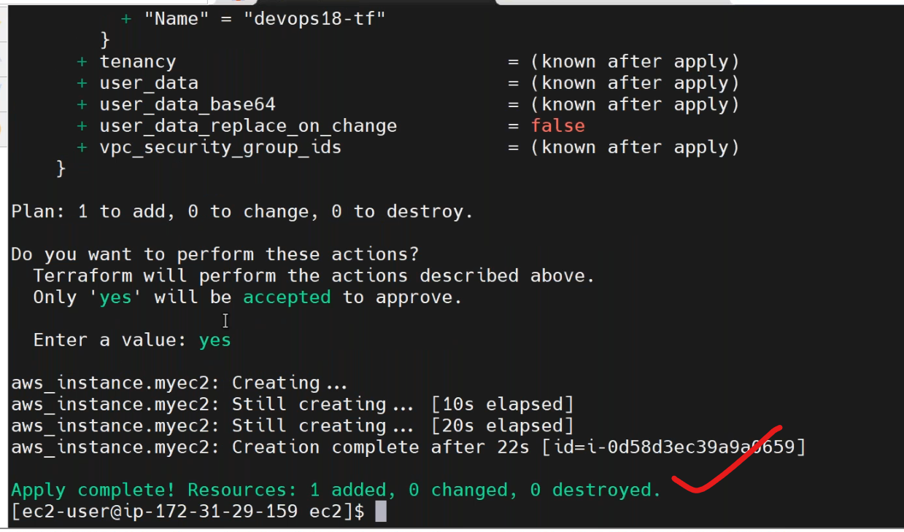
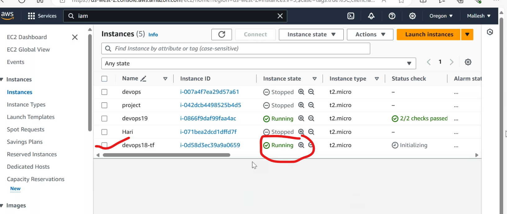

### AMI(amazon machine image) (08/03/2024)
----------------------------------------------
* it is a kind of template to create servers in aws.
* processer details,storage types,etc.
-------------------------------------------------------------------
## terraform
----------------------------------------------------------------------
* `IaaC` tool,for all clouds,opensource,third party tool.
* it can be developed by `hashicorp`.
* cloud specific `Iacs` are
    * AWS - cloudformation
    * AZURE - arn template
### insstallation
---------------------------
* create a ubuntu server,and login into server execute the following commands.
* [Refere Here](https://developer.hashicorp.com/terraform/tutorials/aws-get-started/install-cli) for terraform installation in linux.
* after that execute command `terraform --version`.
* to create any resource in aws by using terraform we need programatic access.
   * so we need `access key`,`secret key`.we can create in `iam`.
 * everything in terraform we write code and save file as `.tf` or `.tpl` file extension.
## first file in terraform
-------------------------------
* `mkdir terraform`,`cd terraform`, write a template for cloud provider by `provider.tf`
* [Refere Here](https://registry.terraform.io/providers/hashicorp/aws/latest/docs) for provider.
```t
terraform {
  required_providers {
    aws = {
      source  = "hashicorp/aws"
      version = "~> 5.0"
    }
  }
}

# Configure the AWS Provider # not a good practice
provider "aws" {
  region = "us-east-1"
  access_key = "my-access-key"
  secret_key = "my-secret-key"
}
```
* we have to create `ec2 instance`,so search for resource in documentaion.
* [Refere Here](https://registry.terraform.io/providers/hashicorp/aws/latest/docs/resources/instance) for ec2 instance.
* write a code for ec2 instance resource `main.tf`
```t
resource "aws_instance" "db" {
  ami           = "ami_id"
  instance_type = "t2.micro"
  # key_name = "my_key"

  tags = {
    Name = "my_ec2"
  }
}
```
* to intilize the provider in terraform, goto path of the terraform file and execute `terraform init`.
```
* init          Prepare your working directory for other commands
```


* to know the content in `.terraform.lock.hcl`
```
cat .terraform.lock.hcl
```

* what is present in `.terraform`?
```
cd .terraform
ls -al
cd providers
ls -al
cd registry.terraform.io
ls -al
```

* to validate the configuration use `terrraform validate`
```
* validate      Check whether the configuration is valid
```

* after execute the plan command `terraform paln`.
```
* plan          Show changes required by the current configuration
```


* add keypair to main.tf.
```t
resource "aws_instance" "db" {
  ami           = "ami_id"
  instance_type = "t2.micro"
  # key_name = "my_key"

  tags = {
    Name = "my_ec2"
  }
}
resource "aws_key_pair" "deployer" {
  key_name   = "my_key"
  public_key = "paste key"
}
```
* after all changes execute apply `terraform apply`.
```
* apply         Create or update infrastructure
```
* after terraform apply somefiles get created.



* execute destroy to delete the infrastructure `terraform destroy`.
```
* destroy       Destroy previously-created infrastructure
```
### Main commands:
```
* init          Prepare your working directory for other commands
* validate      Check whether the configuration is valid
* plan          Show changes required by the current configuration
* apply         Create or update infrastructure
* destroy       Destroy previously-created infrastructure
```

