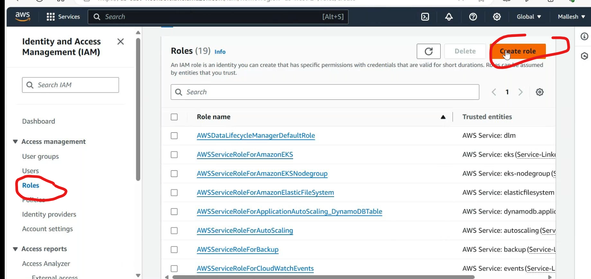
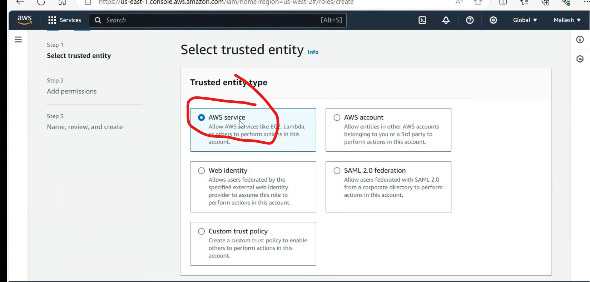
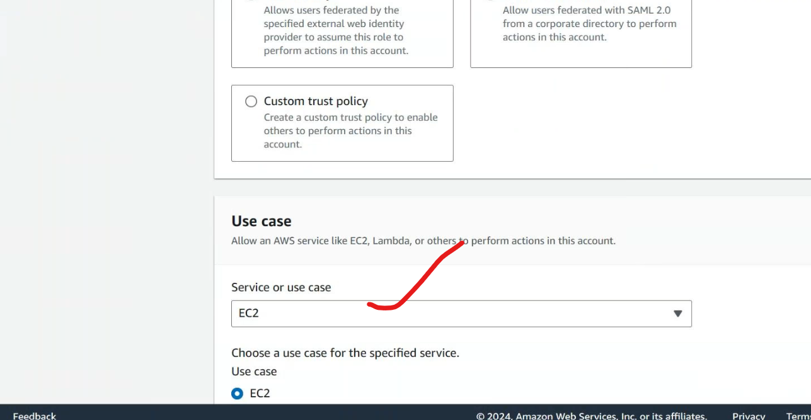
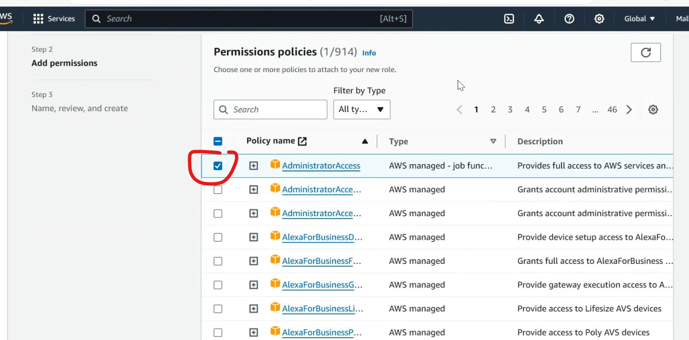
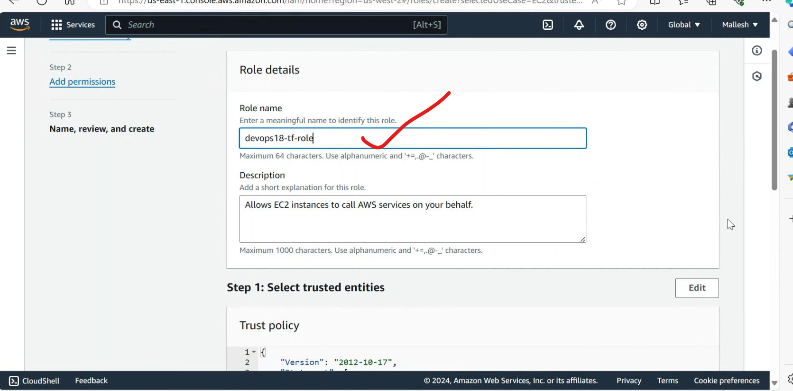
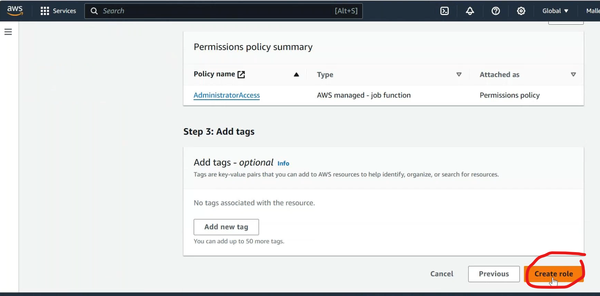
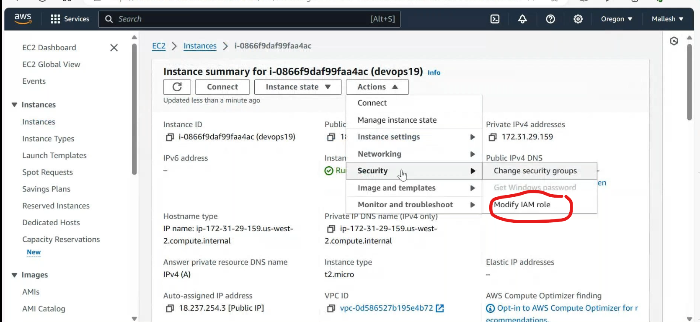
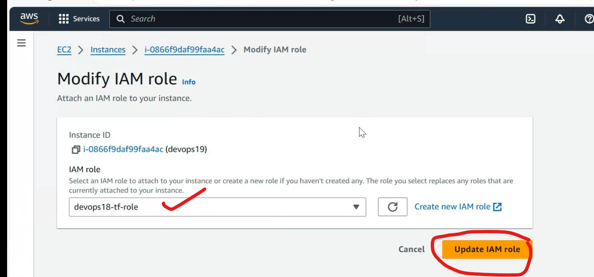
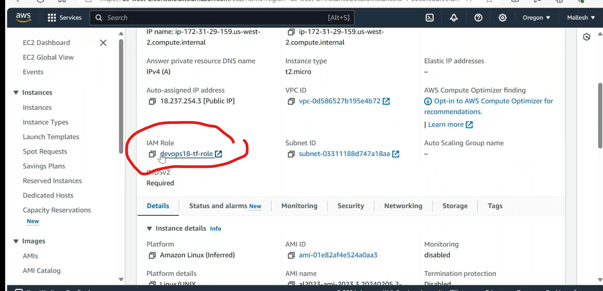
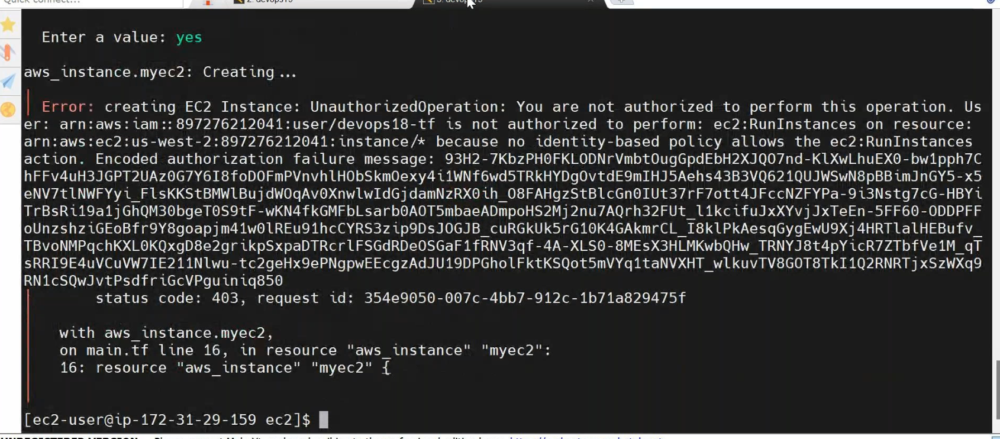

## aws cli configuration (method-2)
--------------------------------------
* to install aws cli [Refere Here](https://docs.aws.amazon.com/cli/latest/userguide/getting-started-install.html).
* configure aws cli after that remove the accesskey and secret key in provider.tf.
```t
terraform {
  required_providers {
    aws = {
      source  = "hashicorp/aws"
      version = "~> 5.0"
    }
  }
}

# Configure the AWS Provider # not a good practice
provider "aws" {
  region = "us-east-1"
}
```
* to configure aws cli by,
```
aws configure
access key:
secret key:
default region:
```
* after execute `terraform plan`.
* after execute `terraform apply`.
## instance profile (method-3) (safest method [secure])
-------------------------------------------
* crreate a role and assign that to ec2 instance.






* add this role to ec2 instance.



* execute `terraform plan`. it is working.but which credintails it will take??
  * if dont have cli keys it takes instance profile.
  * if delete `.aws` folder it works,because it taakes role.
* goto roles of the user edit policy and remove adminstratvie policy and attach ec2readonly policy,after reconfigure the aws cli by `aws configure`.
* after the changing policies execute `terraform apply`.

* `note`: if u have user credintials roles configured into the same ec2 instance, the highest priority is taken by user credintials.
## remote desktop (service based)
### how to generate aws-keypair by terraform??
---------------------------------------------------------------
* [Refere Here](https://registry.terraform.io/providers/hashicorp/aws/latest/docs/resources/key_pair) for keypair creation.
## variables in terraform
-----------------------------------
* 3 types variables
    * input
    * output
    * local
## datasource
---------------------------------
* to know the existing resources data we use `datasource`.
* write a code on to know keypairs in the region `main.tf`
```t
resource "aws_instance" "db" {
  ami           = "ami_id"
  instance_type = "t2.micro"
  # key_name = "my_key"

  tags = {
    Name = "my_ec2"
  }
}
resource "aws_key_pair" "deployer" {
  key_name   = "data.keyname.my_key.id"
  public_key = "paste key"
}
data "aws_key_pair" "keyname" {  # to know keypairs
  key_name           = "my_key"
  include_public_key = true

  filter {
    name   = "tag:Component"
    values = ["web"]
  }
}

output "fingerprint" {
  value = data.aws_key_pair.keyname.fingerprint
}

output "name" {
  value = data.aws_key_pair.keyname.key_name
}

output "id" {
  value = data.aws_key_pair.keyname.id
}
```

