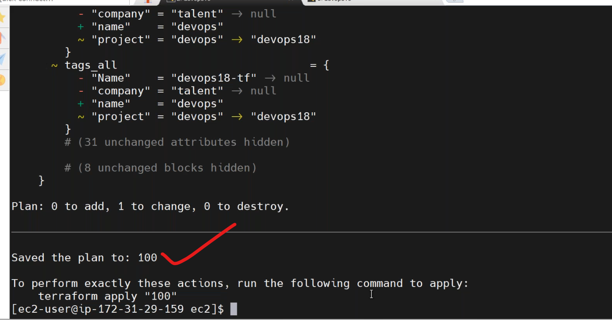
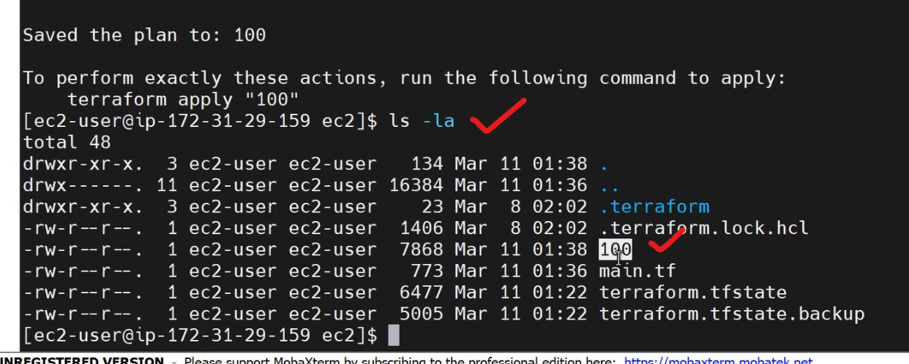
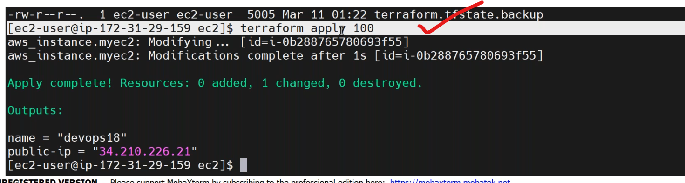
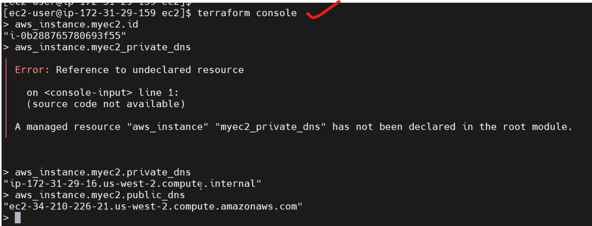

## variables    (11/03/2024)
---------------------------
## terraform plan
--------------------------------
* to save plan in some variable terraform plan by,
```
terraform plan -out 100
```


* to execute the plan 100 by,
```
terraform apply 100
```

* most commonly used commands,
1. `terraform show`.
------------------------------------------------
   * it shows the status.
2. `terraform console`.
---------------------------------------------------------

3. `terraform fmt`.
------------------------------------------------
   * format of terraform code.
   * every data in code is properly arranged.
   * fmt is not part of a main command.
## userdata in aws instance
--------------------------------------
### userdata in terraform


