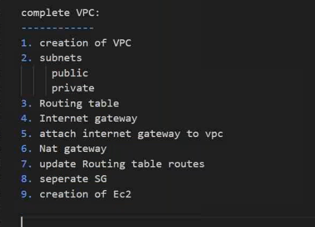

vpc cration in terraform (19/03/2024)
----------------------------------------------------------

* develop a terraform template for entire network.
* create vpc
```t
# creating vpc
resource "aws_vpc" "my_vpc" {
  cidr_block       = "10.0.0.0/16"
  instance_tenancy = "default"

  tags = {
    Name = "vpc_terraform"
  }
}     ## vpc id -
# creating subnets
resource "aws_subnet" "my_subnet1" {
  vpc_id     = aws_vpc.my_vpv.id
  cidr_block = "10.0.1.0/24"
  map_public_ip_on_launch = "true"

  tags = {
    Name = "public_subnet"
  }
}    ## subnet id -
resource "aws_subnet" "my_subnet2" {
  vpc_id     = aws_vpc.my_vpc.id
  cidr_block = "10.0.2.0/24"

  tags = {
    Name = "private_subnet"
  }
}  ## subnet id -
## create a internet gateway
resource "aws_internet_gateway" "IGW" {
  vpc_id = aws_vpc.my_vpc.id

  tags = {
    Name = "vpc_tfm_IGW"
  }
}
## attach igw to vpc
resource "aws_internet_gateway_attachment" "attach" {
  internet_gateway_id = aws_internet_gateway.IGW.id
  vpc_id              = aws_vpc.my_vpc.id
}
## creating a routetables
#### public rt
resource "aws_route_table" "route1" {
  vpc_id = aws_vpc.my_vpc.id

  route {
    cidr_block = "10.0.1.0/24"
    gateway_id = aws_internet_gateway.IGW.id
  }

  tags = {
    Name = "public_rt"
  }
}
## create a elastic ip
resource "aws_eip" "eip" {
  domain   = "vpc"
}

## create NAT gateway
resource "aws_nat_gateway" "NAT" {
  allocation_id = aws_eip.eip.id
  subnet_id     = aws_subnet.my_subnet2.id

  tags = {
    Name = "vpc_tfm_NAT"
  }

  # To ensure proper ordering, it is recommended to add an explicit dependency
  # on the Internet Gateway for the VPC.
  depends_on = [aws_internet_gateway.IGW]
}
#### private rt
resource "aws_route_table" "route2" {
  vpc_id = aws_vpc.my_vpc.id

  route {
    cidr_block = "10.0.2.0/24"
    nat_gateway_id = aws_nat_gateway.NAT.id
  }

  tags = {
    Name = "private_rt"
  }
}
### aws routetable asssociation
resource "aws_route_table_association" "a" {
  subnet_id      = aws_subnet.my_subnets1.id
  route_table_id = aws_route_table.route1.id
}
resource "aws_route_table_association" "b" {
  gateway_id     = aws_internet_gateway.my_subnet2.id
  route_table_id = aws_route_table.route2.id
}
```
## terraform modules usage
-----------------------------------------
* [Refere Here](https://registry.terraform.io/modules/terraform-aws-modules/vpc/aws/latest) for vpc modules in terraform registry.


