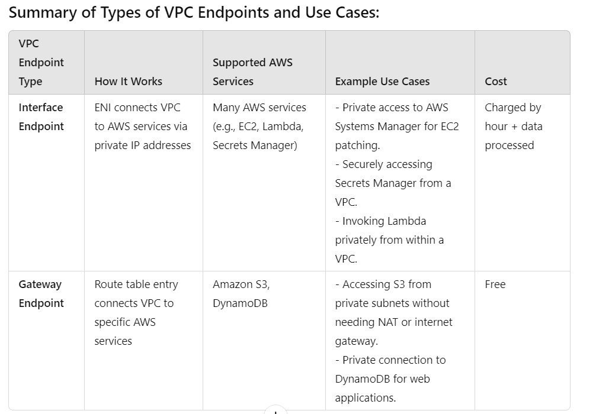
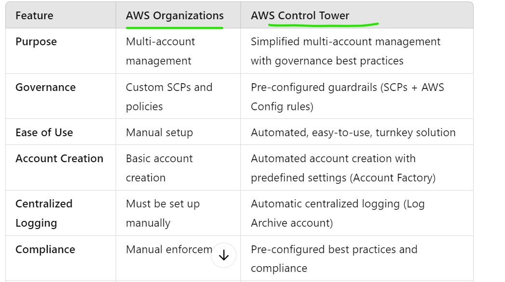

# wipro
---------------------------------------------------------------
### 1. Tell me about yourself and roles and responsibility?
* My name is `name`, and I have over all `4.7 years` of experience in DevOps and build/release process. Throughout my career, I've been involved in setting up and maintaining CI/CD pipelines and delivering releases for multiple applications running on Linux-based distributed infrastructure.
 - Currently I'm working as a DevOps engineer at `xxx IT solutions` from 2020 to till date.
* the tools I worked on are:-
 1. I have managed and configured Git repositories, set up branching and tagging and handled merge requests and notifications to streamline the development process and integrating Git with Jenkins.
 2. I have used maven for building artifacts such as Jar and War files from the source code. this is important in automating the build process and integrating with Jenkins for continuous integration.
 3. For continuous integration and Continuous Deployment (CI/CD) I have used Jenkins , I have set up and managed Jenkins master-slave architectures for distributed builds. I've automated the build process using Jenkins. I've integrated Jenkins with Git and Maven to automate code check-outs and artifact generation.
 4. For resource management I've used Terraform for managing AWS infrastructure as code.
 5. I've worked with docker, creating Dockerfiles and managing Docker images. I've also deployed and managed Kubernetes clusters i.e. EKS on AWS. I've handled tasks such as creating pods, clusters, replication controllers, and managing deployments using YAML files. Moreover, I've implemented Canary deployment strategies to minimize Downtime during updates.
 6. I have worked on AWS cloud technology which includes launching and configuring the EC2 instances, managing IAM roles and policies, setting up VPCs and security groups, and using services like S3, CloudWatch, and Route 53. I've also implemented auto-scaling and load balancing to ensure high availability and fault tolerance.
 7. For Monitoring and logging I have configured monitoring solutions using Prometheus, Grafana, CloudWatch to visualize metrics and logs.
 8. for Project management and collaborations I used tools like JIRA for issue tracking and project management, managing workflows, and generating reports to track project progress and team performance.
I've managed two projects one is related to Healthcare Domain and other is related to insurance domain. Now I am part of the insurance domain 
* my roles in this project is to  maintain Git repositories and automate the build process using Jenkins and Maven as this is java based technology. 
* I've launched and configured EC2 instances, managed S3 buckets, and setup Elastic load balancers and auto scaling groups, used Docker for creating and managing the container images, deployed applications in Kubernetes clusters and managed deployments using Yaml files.

### 2. What is the command for creating git repository?
  ```
  git init
  ```
  * it will intialize the git repository in local with a `.git` folder.
## 3. How to give access to users in git?
 * open any repo in our github account 
 * then goto settings > click on option `collaboraters` > manage access then `add people`.
 * serach by `username/mail/full name` after add the email to repo.
 * send the invitation to the user.
## 3. I deleted one repository in my git account.how will restore that repository?
 ### 1.restore form local copy:
 * If you had previously cloned the repository to your local machine, you can easily restore it by pushing it to a new repository on GitHub.
 * Create a new repository on GitHub (you can use the same name or a different name).
 * In your local project directory, run these commands to push it back to GitHub.
```
git remote add origin <new-repo-URL>
git push -u origin main
```
### 2. Contact GitHub Support:
* If you deleted the repository very recently, GitHub Support may be able to help restore it.
* When contacting support, provide them with the following information:
  * The name of the repository.
  * The approximate time and date of deletion.
### 3. Check for Forks or Collaborators:
* If anyone had forked your repository, you can clone that fork and push it back to GitHub as a new repository.
### 4. Check for Local Backups or Cloud Storage:

### 4. what is diffirence between git merge and git rebase?
* Git merge and Rebase are used to merge the two branches but git rebase will keep the commit history more clear than git merge.
* `Merge`: Typically used in cases where preserving the history of how changes were integrated is important or when working in a shared repository with multiple contributors.
* `Rebase`: Useful for creating a linear history when working on a feature branch, preparing code for integration into a main branch, or cleaning up a messy history before sharing work with others.
### 5. I want to create a branch for that what is the  specific command?
```
git branch <branch-name>
```
### 6. What is the purpose of provider block in terraform?
* it will download the cloud provider information in where we have to create our infra.
```hcl
provider "aws" {
    region= "us-west-2"
}
```
## 7. How to maintain locking in terraform?
* In Terraform, state locking is used to prevent multiple users from concurrently making changes to the infrastructure, which can result in state corruption. 
* By default, Terraform provides state locking automatically when using remote backends such as Amazon S3 or Terraform Cloud.
* When using the S3 backend, Terraform can use DynamoDB for state locking and consistency checking.
   * An `S3 bucket` to store Terraform state.
   * A `DynamoDB table` to handle state locking and prevent concurrent operations.
 * example:
```hcl
terraform {
  backend "s3" {
    bucket         = "my24072024" # change this
    key            = "balu/terraform.tfstate"
    region         = "us-west-2"
    encrypt        = true
    dynamodb_table = "terraform-lock"
  }
}
# first create s3 bucket and creatre dynamodb
```
*  After updating your backend configuration, run the command.
```
terraform init
```
## 8.  What are modules that you have used in terraform?
* vpc,Eks,ec2,iam,s3,security group.
* [Refer Here](https://registry.terraform.io/namespaces/terraform-aws-modules) terraform registry.
### 9.  How to create vpc resource in terraform?
* goto terraform registry and search for the vpc module.copy the vpc module in resource block of our template.
```hcl
module "vpc" {
  source = "terraform-aws-modules/vpc/aws"

  name = "my-vpc"
  cidr = "192.168.0.0/16"

  azs             = ["us-west-2a", "us-west-2b", "us-west-2c"]
  private_subnets = ["192.168.0.0/24", "192.168.1.0/24", "192.168.2.0/24"]
  public_subnets  = ["192.168.3.0/24", "192.168.4.0/24", "192.168.5.0/24"]

  enable_nat_gateway = true
  enable_vpn_gateway = true

  tags = {
    Terraform = "true"
    Environment = "dev"
  }
}
```
* for the manual creation of vpc by using terraform documentation.
```hcl
resource "aws_vpc" "my_vpc" {
    cidr_block = "192.168.0.0/16"
    tags = {
      Name ="tfvpc"
      Env ="dev"
    }
  
}
```

### 10.  What is the purpose of terraform taint?
* terraform taint is used to destroy and recreate the particular resource.
```
terraform taint <resource-name>
```
## 11. What is usage of terraform fmt?
* terraform fmt is used maintain proper standard of configutration files in terraform
```
terraform fmt
```
### 12.  What are the bucket policies in s3?
* Bucket policies in Amazon S3 are resource-based policies that define access permissions for a specific S3 bucket. 
* These policies are written in JSON format and can be used to control who has access to the bucket and what operations (such as read, write, or delete) they can perform on objects within that bucket.
* Bucket policies are commonly used to grant permissions to:
  * AWS accounts and IAM users/roles.
  * Public access (with caution).
  * External AWS services.
* example: Restricting Access to Specific IP Address.
```json
{
    "Version": "2012-10-17",
    "Statement": [
        {
            "Effect": "Deny",
            "Principal": "*",
            "Action": "s3:*",
            "Resource": "arn:aws:s3:::your-bucket-name/*",
            "Condition": {
                "NotIpAddress": {
                    "aws:SourceIp": "203.0.113.0/24"
                }
            }
        }
    ]
}
```
### 13.  Have worked on build tools?
*  maven is a build automation tool used primarily for java projects.
*   maven helps in managing dependencies efficiently. 
*   by defining dependencies in the `pom.xml` file, maven handles downloading and including the required libraries.
* `1. Compile`:
	- this goal complies the source code of the project.
	- it takes the source code from `/src/main/java directory` and compile it into `/target/classes` directory.
- command : `"mvn compile"`.
* `2. test`:
	- this goal runs the unit tests using the suitable testing framework like Junit.
	- it compiles the test code located in the /src/test/java directory and then runs the test.
	- command : "mvn test"
* `3. package`:
            package => Create a packaging format (jar, war) after generating classes and test execution
* `4. install`:
	- this goal installs the package into the local repository, making it available for the other projects in the same machine.
	- it is used to share the artifacts among multiple projects in a local development environment.
	-  command: "mvn install".
* `5. Deploy`:
	- this goal copies the final package to a remote repository for sharing with other developers or deploying to a production environment.
	- it is typically used in continuous integration and continuous deployment pipelines.
	- command: "mvn deploy"
* `Clean`:
    clean => remove target folder.

  
### 14.  Have worked artifactory repository how to integrate maven project?
nexus.
### 15.  Have you worked on sonerqube?
* code analysis.
### 16.  How to integrate sonerqube in your project?
* Integrating SonarQube with Jenkins helps automate the process of code quality analysis as part of your continuous integration (CI) pipeline.
### Step 1: Install SonarQube Scanner Plugin in Jenkins:
### Step 2: Configure SonarQube in Jenkins.
* Go to Manage Jenkins > Configure System.
* Scroll down to the SonarQube servers section.
* Click on Add SonarQube.
```
Name: Give your SonarQube server a name (e.g., SonarQube).
Server URL: Add your SonarQube server’s URL (e.g., http://localhost:9000 or your server's IP/hostname if hosted remotely).
```
* Click on the Add button next to Server authentication token.
* Create a Token in SonarQube (User > My Account > Security > Generate Token).
* Enter a name for the token in Jenkins and paste the token generated in SonarQube.
* Click Test Connection to verify the connection between Jenkins and SonarQube.
* Save the configuration.
### Step 3: Configure the SonarQube Scanner in Jenkins
* Go to Manage Jenkins > Global Tool Configuration.
* Scroll to the SonarQube Scanner section and click Add SonarQube Scanner.
* Under Install automatically, choose the appropriate version, or you can manually install the scanner on your machine.
* Save the configuration.
### Step 4: Add SonarQube Analysis to Jenkins Pipeline (Declarative)
* For a Jenkins Pipeline project, you can define SonarQube analysis as part of your pipeline script using the sonar command.
```jenkinsfile
pipeline {
    agent any

    tools {
        maven 'Maven3'  // Name of your Maven installation in Jenkins
        jdk 'Java11'    // JDK configured in Jenkins
    }

    stages {
        stage('Build') {
            steps {
                sh 'mvn clean package'
            }
        }

        stage('SonarQube Analysis') {
            environment {
                scannerHome = tool 'SonarQubeScanner'  // Name of the SonarQube Scanner in Jenkins Global Tool Configuration
            }
            steps {
                withSonarQubeEnv('SonarQube') {  // 'SonarQube' is the name you configured for SonarQube in Jenkins
                    sh "${scannerHome}/bin/sonar-scanner \
                        -Dsonar.projectKey=my-project-key \
                        -Dsonar.sources=src \
                        -Dsonar.host.url=http://localhost:9000 \
                        -Dsonar.login=<your-sonarqube-token>"
                }
            }
        }

        stage('Quality Gate') {
            steps {
                script {
                    timeout(time: 1, unit: 'MINUTES') {
                        waitForQualityGate abortPipeline: true
                    }
                }
            }
        }
    }
}
```

### 17.  What is the difference between profile and quality gates in sonerqube?
* In SonarQube, both Quality Profiles and Quality Gates play crucial roles in managing code quality, but they serve different purposes and focus on different aspects of code analysis:

### `1. Quality Profile`:
* A Quality Profile is a set of rules used to define coding standards for a specific programming language. 
* It is essentially a collection of coding rules that determine what should be checked when analyzing a codebase.
* example:A team may set up a Java Quality Profile that enforces rules like limiting method complexity, avoiding deprecated APIs, and ensuring proper exception handling.
### `2. Quality Gate`:
* A Quality Gate is a set of conditions or thresholds that a project must meet to pass the overall quality check. 
* It serves as the final decision-maker on whether the code is acceptable or not based on various quality metrics.
* example: A team may define a Quality Gate that requires at least 80% code coverage by tests, no new security vulnerabilities, and a technical debt ratio under 5%. If any of these thresholds are not met, the Quality Gate will fail, and the team will have to fix the issues before merging or deploying the code.
  
### 18.  Tell me pipeline configuration in your project?
* there r different stages in our pipeline.
```jenkinsfile
pipeline 
  agent any {
   stages {
    stage('checkout') {
        steps {
            echo "git checkout"
        }
    stage('sonar analysis') {
        steps {
            echo "sonar analysis"
        }
    stage('build') {
        steps {
            echo "mavn package"
        }
    stage('archive') {
        steps {
            echo " archive the artifacts "

        }
    }
   }
```
### 19.  Have worked on EKS ?
* yes.

### 20.  What is the purpose kube-scheduler in eks?
* It watches for new work tasks and assigns them to healthy nodes in the cluster.
### 21.  What is the purpose of default schedular?

### 22.  What is the purpose of HPA?
* HPA increases or decreases the number of running pod replicas based on the workload. 
* It scales "horizontally," meaning it adds or removes replicas of pods rather than increasing the size of an individual pod ("vertical scaling").
* The HPA controller in Kubernetes queries the metrics server (such as Kubernetes Metrics Server, Prometheus, or Custom Metrics API) to retrieve real-time resource utilization data (e.g., CPU or memory usage).
* Based on the metrics, it determines whether to scale the number of pod replicas up or down. For example, if the average CPU utilization across the pods in a deployment exceeds a certain threshold (e.g., 70%), HPA will add more replicas to handle the load.
```yaml
apiVersion: autoscaling/v1
kind: HorizontalPodAutoscaler
metadata:
  name: my-app-hpa
spec:
  scaleTargetRef:
    apiVersion: apps/v1
    kind: Deployment
    name: my-app-deployment
  minReplicas: 2
  maxReplicas: 10
  targetCPUUtilizationPercentage: 70
```
### Custom Metrics in HPA:
* In addition to CPU and memory metrics, HPA can also use custom metrics (such as request count, latency, or any application-specific metric). 
* This is done by integrating the Kubernetes cluster with a metrics provider like Prometheus or a custom metrics API.
```yaml
apiVersion: autoscaling/v2beta2
kind: HorizontalPodAutoscaler
metadata:
  name: custom-hpa
spec:
  scaleTargetRef:
    apiVersion: apps/v1
    kind: Deployment
    name: my-app-deployment
  minReplicas: 2
  maxReplicas: 10
  metrics:
  - type: Pods
    pods:
      metric:
        name: requests_per_second
      target:
        type: AverageValue
        averageValue: 100
```
### 23.  What is usage Aws waf?
* AWS WAF (Web Application Firewall) is a security service designed to protect web applications from common web exploits and vulnerabilities that could affect application availability, compromise security, or consume excessive resources. 
* It provides users with control over which traffic to allow or block to their web applications by defining customizable web security rules.
### Protection Against Common Web Attacks:
* AWS WAF helps protect applications from common web attacks such as SQL injection and cross-site scripting (XSS). 
* By defining specific rules, you can block malicious requests before they reach your application.
### Rate Limiting:
* You can set rules to limit the number of requests from a specific IP address over a defined time period. 
* This helps mitigate Denial of Service (DoS) attacks and abusive behaviors by throttling the number of requests made by a user.
### IP Whitelisting and Blacklisting:
* AWS WAF allows you to create rules to allow or block traffic based on IP addresses. 
* For example, you can whitelist trusted IPs to ensure only specific users can access your application or block known malicious IP addresses.
### Customizable Rules:
* AWS WAF lets you create custom rules tailored to your application's needs. 
* You can inspect HTTP requests for specific patterns or criteria, such as headers, URI strings, query string parameters, or request body content.
### Integration with AWS Services:
* AWS WAF is integrated with other AWS services like Amazon CloudFront, Application Load Balancer (ALB), and API Gateway. 
* This integration provides a layered security approach and allows you to enforce WAF rules at the edge or at the application layer.
### Monitoring and Logging:
* AWS WAF offers detailed logging of all requests processed by the WAF.
*  You can monitor these logs in real-time, analyze traffic patterns, and gain insights into potential threats.
### Geo-Blocking:
* AWS WAF allows you to create rules to block or allow requests based on the geographic location of the incoming requests. 
* This can help prevent attacks originating from specific countries or regions.

* AWS WAF follows a `pay-as-you-go` pricing model. You pay for the number of web ACLs, rules, and requests processed, allowing you to scale your usage based on the needs of your application.
### 24.  Why you are using aws waf we have a security group for blocking ip address?
### AWS Security Groups:
* Operate at the network layer (Layer 4).
* Control inbound and outbound traffic to/from EC2 instances or other AWS resources based on IP addresses, ports, and protocols.
* Good for allowing or denying access from certain IP ranges but does not provide protection against application-layer threats.
### AWS WAF:
* Operates at the application layer (Layer 7).
* Provides protection against specific web-based threats, such as SQL injection, cross-site scripting (XSS), and bad bots.
* Allows more granular control based on HTTP request attributes (e.g., headers, body, URIs), which is not possible with Security Groups.
### 25.  How to configure eks cluster in cloud watch?
* Configuring Amazon EKS (Elastic Kubernetes Service) to send logs and metrics to Amazon CloudWatch involves several steps, including creating an EKS cluster, configuring the necessary IAM roles, and deploying the CloudWatch agent.
### 1. Create an EKS Cluster:
### 2. Configure IAM Roles for CloudWatch:
* You will need an IAM role that the EKS cluster and nodes can assume to publish logs to CloudWatch.
    #### Create an IAM Role for the EKS Cluster:
    ----------------------------------------------
```yaml
{
  "Version": "2012-10-17",
  "Statement": [
    {
      "Effect": "Allow",
      "Principal": {
        "Service": "eks.amazonaws.com"
      },
      "Action": "sts:AssumeRole"
    }
  ]
}
```
   #### Attach CloudWatch Policy to the Role:
   * Attach the following AWS managed policy to the role: AmazonEKSClusterPolicy.
   ### Create an IAM Role for Node Groups:
   * Create another IAM role for your node group with a similar trust relationship but allowing EC2 instances to assume the role:
```yaml
{
  "Version": "2012-10-17",
  "Statement": [
    {
      "Effect": "Allow",
      "Principal": {
        "Service": "ec2.amazonaws.com"
      },
      "Action": "sts:AssumeRole"
    }
  ]
}

```
   * Attach the following policies to the node role:
       * AmazonEKSWorkerNodePolicy
       * AmazonEC2ContainerRegistryReadOnly
       * CloudWatchAgentServerPolicy
### 3. Deploy the CloudWatch Agent
* You can use a Kubernetes manifest to deploy the CloudWatch agent, which collects logs and metrics from the EKS cluster and sends them to CloudWatch.
#### Create a ConfigMap for the CloudWatch Agent
```yaml
apiVersion: v1
kind: ConfigMap
metadata:
  name: cwagentconfig
  namespace: kube-system
data:
  cwagentconfig.json: | 
    {
      "logs": {
        "logs_collected": {
          "files": {
            "collect_list": [
              {
                "file_path": "/var/log/containers/*.log",
                "file_type": "log",
                "multiline_start_pattern": "{timestamp_format}"
              }
            ]
          }
        }
      }
    }

```
#### Deploy the CloudWatch Agent DaemonSet:
```yaml
apiVersion: apps/v1
kind: DaemonSet
metadata:
  name: cwagent
  namespace: kube-system
spec:
  selector:
    matchLabels:
      name: cwagent
  template:
    metadata:
      labels:
        name: cwagent
    spec:
      containers:
      - name: cwagent
        image: amazon/cloudwatch-agent:latest
        env:
        - name: CWAGENT_CONFIG
          value: "cwagentconfig"
        volumeMounts:
        - name: cwagentconfig
          mountPath: /etc/cwagentconfig
        - name: varlog
          mountPath: /var/log/containers
      volumes:
      - name: cwagentconfig
        configMap:
          name: cwagentconfig
      - name: varlog
        hostPath:
          path: /var/log/containers

```
### Apply the DaemonSet:
```
kubectl apply -f cwagent-daemonset.yaml
```
### 4. Verify the Setup
* After deploying the CloudWatch agent, you can check the CloudWatch console to verify that logs and metrics are being collected.
```
kubectl get daemonset -n kube-system
```
### 5.Monitoring and Logging
* You can now monitor your EKS cluster logs and metrics in the CloudWatch Logs and CloudWatch Metrics sections of the AWS Management Console.
* You can also create CloudWatch Alarms based on the metrics collected from your EKS cluster.

### 26.  What is purpose of Prometheus and grafana?
* prometheus will collect the metrics of the server and graphan will visualize the metrics in defualt/custom dashboards.  
### 27.  Why grafana needed already we have a premotheus?
* visualization.
### 28. What is the SCM you used in your project?
* Git
### 29. what are the types of vpc endpoints?
* VPC Endpoints are used to securely connect your Amazon Virtual Private Cloud (VPC) to AWS services or other resources without needing to traverse the public internet.
### 1. Interface Endpoints:
* Interface Endpoints use an `elastic network interface (ENI)` in your VPC to connect to supported AWS services using private IP addresses within your VPC.
* You associate the endpoint with one or more subnets in your VPC, and traffic to the supported AWS service is routed through the ENI.
* Services such as Amazon EC2 API, Amazon S3 API (not the data plane), AWS Systems Manager, Lambda, Secrets Manager, KMS, CloudWatch, and many more.
* Interface Endpoints `charge` based on the number of hours the endpoint is active and the amount of data processed.
### 2. Gateway Endpoints:
* Gateway Endpoints are used to connect your VPC to supported AWS services by adding a target to your route table. 
* Traffic destined for the service is routed privately through the AWS backbone.
* Currently, Gateway Endpoints support only Amazon S3 and DynamoDB.
* Gateway Endpoints are `free to use`; there are no hourly or data processing charges.

### 30.what is the aws control tower?
### AWS Organizations:
* Ideal for organizations that want to manage multiple AWS accounts with custom governance models.
* Suitable for advanced users who want more control and flexibility over how accounts are organized, governed, and secured.
### AWS Control Tower:
* Ideal for organizations that want a quick start with a pre-configured, well-architected multi-account environment.
* Suitable for teams that want to enforce AWS best practices and security policies without extensive manual configurations.

### 31. what is aws athena?
* AWS Athena is a serverless, interactive query service that allows you to analyze data directly in Amazon S3 using SQL. 
* You can run queries on structured, semi-structured, or unstructured data, such as CSV, JSON, Parquet, and ORC files, without needing to set up complex data pipelines or infrastructure.
* use cases are Log Analysis,Ad-hoc Data Exploration,Big Data Analytics,Business Intelligence (BI) Integration,Data Lake Queries.

## shyftlabs
----------------------------------------------------------------------
 ### 1. i have a senario that that there are millions of requests are receving how you maintain?
 * To handle millions of incoming requests effectively, it’s crucial to design a system that is scalable, reliable, and efficient.
### 1. Load Balancing
* Use Load Balancers: Distribute incoming requests across multiple servers to avoid overloading any single server.
### 2. Horizontal Scaling
* Scale Out: Add more servers or instances to handle the increasing load. Cloud platforms like AWS, Azure, or GCP offer auto-scaling capabilities, where resources are automatically added or removed based on traffic.
### 3. Database Optimization
* `Read/Write Splitting`: Use separate databases for reads and writes. Use replication to scale read-heavy traffic across multiple instances.
* `Sharding`: Partition large databases into smaller, more manageable pieces across multiple servers.
* `Indexing`: Ensure that database queries are optimized and appropriately indexed to avoid slow queries.
### 4. Microservices Architecture
* `Break Down Monolithic Applications`: Split your application into microservices that handle different functions (e.g., user management, payments). 
* This improves fault isolation and allows scaling specific parts of your system independently.
* `Use Message Queues`: Implement asynchronous processing using message queues like Kafka, RabbitMQ, or AWS SQS. 
* This helps handle spikes in traffic and prevents overloading backend services.
### 5. Rate Limiting and Throttling
* `Rate Limit Users`: Control the rate of incoming requests per user or IP to protect the system from being overwhelmed by excessive requests (either intentionally or due to bugs).
* `Throttling`: In the case of heavy traffic, gracefully degrade service by slowing down responses rather than rejecting requests outright.
### 6. Monitoring and Auto-Scaling
* `Real-time Monitoring`: Use monitoring tools (e.g., Prometheus, Datadog, Grafana) to track the health of your system. 
* Metrics like CPU usage, memory usage, and request latency can provide insights into when to scale.
* `Auto-scaling`: Configure your system to automatically scale up or down based on traffic patterns using platforms like Kubernetes or cloud-based auto-scaling.
 ### 2. there are a malicious attacks from respective country like china how you restrict it?
 ### 1. Geo-blocking (Country-based IP Blocking)
* `IP-Based Restrictions`: Use geo-blocking to block IP addresses originating from China or any specific country at the network level. 
* Many CDNs (e.g., Cloudflare, Akamai) and firewalls (e.g., AWS WAF, Azure Firewall) provide geo-restriction capabilities, allowing you to block requests based on the country of origin.
* `Limit Network Access`: Block entire ranges of IP addresses that are assigned to China’s internet service providers (ISPs) using IP filtering or IP blocklists.
### 2. Web Application Firewall (WAF)
* `Deploy a WAF`: Use a Web Application Firewall (e.g., AWS WAF, Cloudflare WAF) to filter and block malicious requests. 
* Many WAFs can detect patterns of attacks like SQL injections, XSS, or bot activity, and can be configured to specifically restrict requests from certain countries, including China.
* `Custom Rules`: Write custom rules to block traffic from China, such as blocking traffic based on the User-Agent or request behavior (e.g., frequent bot-like activity from certain regions).
* `Cloudflare`: Geo-blocking, WAF, DDoS protection, and bot mitigation.
* `AWS WAF & AWS Shield`: Geo-blocking and advanced DDoS protection.

 ### 3. in a scenario you was ideal busy with some work from a particlular dns or ip keep on requesting and using max cpu how you restrict it?
 * If a particular DNS or IP is repeatedly making requests and consuming maximum CPU resources, you need to mitigate this situation quickly to avoid degrading system performance.
### 1. Immediate Mitigation: Block the IP/DNS
* `Firewall Rule Addition`:
* Immediately block the specific IP address or range of IPs at the firewall level. 
* Use network firewalls (e.g., iptables, AWS Security Groups, Azure Firewall, or any cloud provider firewall) to drop incoming packets from the malicious IP.
```
iptables -A INPUT -s <malicious_ip> -j DROP
```
### 2. Rate Limiting
* `Apply Rate Limits`: Immediately implement rate limiting for the specific DNS or IP that is overwhelming the system. 
* For example, you can limit the number of requests from that IP or DNS within a specified timeframe.
* `Global Rate Limiting`: Set a global rate limit for all users, but apply stricter limits to the problematic IP address to restrict how many requests it can send per second or minute.
### 3. IP Blocking
* `Block the IP Address`: If it’s clear that the traffic from a specific IP or DNS is malicious or abusive, block it entirely at your firewall, load balancer, or CDN level. 
* You can block the IP using tools like:
  * iptables (on Linux systems)
  * AWS Security Groups/NACLs
  * CDN firewalls like Cloudflare, AWS WAF, or Akamai.
### 4. Use Web Application Firewall (WAF)
* `Deploy or Update WAF Rules`: If not already in place, deploy a WAF (e.g., AWS WAF, Cloudflare WAF) and create custom rules to detect and block excessive traffic from the offending IP or DNS.
* WAFs can block requests based on behavior, including if too many requests are coming from the same IP in a short period, preventing further CPU exhaustion.
* `WAF Rate-Limiting Rules`: Many WAFs allow you to automatically throttle or block requests if they exceed certain thresholds.
 ### 4. what is webhook how you setup this what is its role?
* Webhooks allow external services to be notified when certain events happen. When the specified events happen, we'll send a `POST request` to each of the URLs you provide.
* A webhook is a way for one system or application to send real-time data to another system when a specific event occurs. 
*  It allows one application to notify another of events, often automatically.
*  Unlike APIs where you pull data by making requests, webhooks push data to a specified URL as soon as an event happens.
* example: `git webhooks`
* goto the `repo > seetings > webhooks > add payload url (http://<ip>:8080/github-webhook)>` .

## Fineco 
----------------------------------------------------------------------
### 1. What is cloudfront?
* Amazon CloudFront is a powerful CDN that helps deliver content to users worldwide with low latency, high security, and cost-effective caching.
* It’s ideal for web applications, media streaming, API acceleration, and content-heavy websites. 
* By caching content at edge locations, CloudFront enhances performance and ensures fast delivery while providing security against cyber threats like DDoS attacks.
### Supports Multiple Origins
* You can use CloudFront with different types of origin servers:
* `S3 Buckets`: To serve static files like images, CSS, JavaScript, or videos.
* `Custom Origins (HTTP Servers)`: Any web server running on AWS (e.g., EC2) or on-premises to serve dynamic content.
### 2. How did you implement Cross-region delivery?
* `Origin Setup`: You have an S3 bucket located in the us-east-1 (N. Virginia) region, and you want to distribute content globally with low latency.
* `CloudFront Distribution`: Create a CloudFront distribution and configure the origin to point to the S3 bucket. 
* CloudFront will cache the content at its edge locations worldwide, allowing users in Europe, Asia, and South America to receive content from the nearest CloudFront edge location.
* `Cache Behavior`: Configure the cache behavior to set different TTLs for static and dynamic content. 
* For example, you might cache static images for 24 hours, while dynamic API responses are cached for 5 minutes.
### 3. how did you restrict a region for example china region is not allowed to access application. explain its process?

### 4. What do you know about CDK?
* The AWS Cloud Development Kit (CDK) is an open-source software development framework provided by Amazon Web Services (AWS) that allows developers to define cloud infrastructure using familiar programming languages like TypeScript, JavaScript, Python, Java, and C#.
* AWS CDK simplifies the way you define and provision AWS cloud infrastructure by using programming languages instead of YAML or JSON templates.
### 5. What is terraform blocks?
* In Terraform, blocks are the fundamental building units that define various aspects of infrastructure. 
* Each block specifies a particular resource, data source, provider, or configuration that Terraform will manage.
* `Provider Block` sets up the connection to your cloud provider (e.g., AWS, Azure, GCP).
```hcl
provider "aws" {
	region= "us-west-2"
}
```
* `Resource Block` defines the infrastructure components (e.g., EC2 instances, databases, VPCs).
```hcl
resource "aws_vpc" "my_vpc {
	cidr_block = "192.168.0.0/16
	tags = {
		Name= "vpc"
		Env= "dev"
	}
}
```
* `Data Block` retrieves information about existing resources that aren't managed by Terraform.
```hcl
data "aws_ami" "ubuntu" {
  most_recent = true
  filter {
    name   = "name"
    values = ["ubuntu/images/hvm-ssd/ubuntu-bionic-18.04-amd64-server-*"]
  }
  owners = ["099720109477"]  # Canonical's AWS account ID
}
```
* `Output Block` returns key values from your infrastructure, like IP addresses or IDs.
```hcl
output "instance_ip" {
  value = aws_instance.my_ec2_instance.public_ip
}
```
* `Variable Block` allows customization of configurations by passing in different values.
```hcl
variable "instance_type" {
  type        = string
  default     = "t2.micro"
  description = "Type of EC2 instance to create"
}
```
* `Module Block` helps in creating reusable, modular infrastructure components.
```hcl
module "network" {
  source = "./modules/network"
  vpc_id = "vpc-123456"
}
```
* `Terraform Block` sets up the Terraform environment and backend configuration.
```hcl
terraform {
  required_providers {
    aws = {
      source  = "hashicorp/aws"
      version = "~> 3.0"
    }
  }

  backend "s3" {
    bucket = "my-terraform-state"
    key    = "global/s3/terraform.tfstate"
    region = "us-east-1"
  }
}
```
* `Locals Block` defines variables for internal use in the Terraform configuration.
```hcl
locals {
  instance_name = "production-instance"
  environment   = "production"
}
```
### 2. How did you use Dynamo DB table for locking Statefile?

### 3. What are the Databases you use in your project?
* mysql,mariadb,postgres.

### 4. How did you face a challenge for sudden traffic increase and how did you consider that is not harmful traffic and what measures did you take to get rid of them?

## LTI
-----
### 1.Asked each and every details of the project and implementation?
### 2.majorly focused on ansible with Python scripting?

## Infosys
-------------------------------------
### 1. introduce yourself in brief2. what are the challenges you have faced?
### git
--------------------------------------------------------------------
 * 1. Merge Conflicts
 * 2. Branching Strategy
 * 3. Rebasing vs. Merging
### jenkins
-------------------------------------------
* 1. build failures
* 2. jenkins master slowness
* 3. plugin conflicts
*  4. authentication problems
*  5. failure builds in specific agents
*  6. pipeline stuck at a stage
*  7. docker integration issues
*  8. in correct workspace clean up
*  9. SCM polling failures
*  10. pipeline timeouts
###  docker
------------------------------------------------------
* 1. Image Size and Management

### kubernetes
-------------------------------------------------
* 1. imagepullbackoff
* 2. errorimage pull
* 3. registry unavailable
* 4. invalid image name
* 5. creshloopbackoff
* 6. killcontainer error
* 7. OOM killed

### terraform
----------------------------------------------------
* 1. Dependency Errors
* 2. State File Issues
* 3. Resource Configuration Errors
* 4. Provider Errors
* 5. Module Errors
* 6. Variable and Output Management
* 7. Authentication Issues
* 8. Terraform Upgrade Issues

### 2.diffrence btween git pull and git clone?
* `git clone`: git clone is used to download the repository from remote to local.
* `git pull` : git pull will update the changes from remote repo to local repo.
### 3.diffrencw between entrypoint and cmd?
* both the instructions are used to run a command after starting the container.
* `entrypoint`: it will not overridden.
* `CMD`: it will be overridden.we should always have a command which has longlive in CMD.
  
### 4.what is docker compose?
* Docker compose can run multiple containers in a Docker and also
  lets define the necessary volumes and networks.
* Docker Compose is a tool for defining and running multi-container Docker applications.
* you to configure your application’s services, networks, and volumes in a single YAML file called `docker-compose.yml`.
```
docker-compose.yaml up -d
docker-compose.yaml down
```
```yaml
version: '3.8'

services:
  app:
    build:
      context: ./app
    ports:
      - "5000:5000"  # Expose port 5000 to the host
    depends_on:
      - redis  # Ensure Redis is started before the app
    environment:
      - REDIS_HOST=redis  # Set the Redis host environment variable

  redis:
    image: redis:alpine  # Use the official Redis image

  web:
    image: nginx:alpine  # Use the official Nginx image
    ports:
      - "80:80"  # Expose port 80 to the host
    volumes:
      - ./nginx/default.conf:/etc/nginx/conf.d/default.conf  # Mount the Nginx config
    depends_on:
      - app  # Ensure the app is started before Nginx
```
### 5.how ecr works what is purpouse of ecr?
* 
### 6.what are s3 storage classes?
* S3 offeres multiple staorage classes.
   * Standard
   * Intelligent- tiering
   * Standard-1A(infrequent access)
   * One zone 1A
   * Glacier
   * Glacier deep archive.

### 7.what are the types of services in k8?
### 1. ClusterIP:
* This is the default service type. It exposes the service on a cluster-internal IP, making it accessible only within the cluster.
* Suitable for internal communication between Pods. For example, a database service that should not be exposed to the outside world.
```yaml
apiVersion: v1
kind: Service
metadata:
  name: my-clusterip-service
spec:
  type: ClusterIP
  selector:
    app: my-app
  ports:
    - port: 80
      targetPort: 8080

```
### 2. NodePort
* This service type exposes the service on each Node’s IP at a static port (the NodePort). A request to the Node’s IP and the NodePort will be forwarded to the service.
* Useful for development and testing environments where you need to access services externally without setting up a load balancer.
```yaml
apiVersion: v1
kind: Service
metadata:
  name: my-nodeport-service
spec:
  type: NodePort
  selector:
    app: my-app
  ports:
    - port: 80
      targetPort: 8080
      nodePort: 30000  # This is the port that will be exposed on the node

```
### 3. LoadBalancer
* This service type exposes the service externally using a cloud provider’s load balancer. It automatically provisions a load balancer and assigns a public IP.
* Ideal for production applications that require external access and high availability.
```yaml
apiVersion: v1
kind: Service
metadata:
  name: my-loadbalancer-service
spec:
  type: LoadBalancer
  selector:
    app: my-app
  ports:
    - port: 80
      targetPort: 8080

```
### 4. ExternalName
* This service type maps a service to the DNS name of an external service (like an API or a database) and does not create any proxy or load balancing.
* Useful for integrating external services without exposing them as a Kubernetes service.
```yaml
apiVersion: v1
kind: Service
metadata:
  name: my-externalname-service
spec:
  type: ExternalName
  externalName: external.api.com  # The external service's DNS name

```
### 5. Headless Services
* A headless service does not have a cluster IP and allows direct access to the Pods. This is useful for StatefulSets or when you want to manage load balancing yourself.
* Useful for applications that require direct Pod-to-Pod communication (like databases or clustered applications).
```yaml
apiVersion: v1
kind: Service
metadata:
  name: my-headless-service
spec:
  clusterIP: None  # No cluster IP
  selector:
    app: my-app
  ports:
    - port: 80
      targetPort: 8080

```

### 8.what is perpouse of using clusterIP with help of localhost also there is communication is happening righy then again why u r using clusterIP?
* While local communication through localhost can work for a single container or Pod, ClusterIP enhances the scalability, reliability, and security of service communication within a Kubernetes cluster.
* `1. Internal Communication`:
   * ClusterIP allows Pods to communicate with each other using a stable internal IP address, which abstracts the underlying Pods.
* `2. Service Discovery`:
   * ClusterIP allows for easier service discovery within the cluster.
### 9.what is the process of getting use of repositry in git?

### 10.what is git rebase?

## nowcom
--------------
1. tell me day to day activities.
2. what are the issues faced in project and how to communicate with developers. regarding issues
3. what type of branching strategie you can follow
4. tell me ci process and cd process
5. how to.connect eks cluster
6. how to maintain secrets in your project
7. what version you used in eks cluster.
8. what container runtime used in eks version 1.26 (docker or containerd)
9. how to login master node in eks cluster?
10. how to maintain security in pod level
11. how to communicate one pod to another pod
12. what are the issues faced to deploy application into eks cluster
13. how nodes and pods in your cluster?
14. what type of instance type used in cluster nodes
15. tell me about route53 records
16. i defined /28 cidr block is it possible to create vpc
17. how many ip address block in subnet ipadderess which purpose aws block that ip address
18. what are the services used in aws services.
19. difference between deployment and deamonset.
20. i created two same vpc cidr block in same region is it possible to communicate each other?
21. where you are stored secrets.
22. what are the tools used in monitoring in your project
23. how to integrate jenkins to eks
24.how to create empty image or image without os or alphine in docker?
is container inside container possible?
25.how instances in private subnet can communicate with other aws services?

## Firstsource(ets):
------------------------------------------------------------
How to establish communication between containers and pods?
How to create ec2 instance without ami id using terraform?
How network works in container communication?
How to maintain resources using terraform?
Change type of instance in node group of eks cluster using terraform?
How to establish connection betweek s3 bucket and instance in private subnets?
What are the functions used in aws lambda for deployment?

### hexaware
------------------------------------------------------------------
1. diffrence between static inventory and dynamic inventroy 
2. how you create users in multple envinoements using ansible
3. how you maintain artifactroy in jenkins
4. what will happens in during build 
5. how you do CI/CD in multple environments
6. how can we do CI/CD for specific branch in jenkins
7. some of the new questions I faced so far
how does nexus or artifactory storage work in automation
bucket policies types what you have implemented inn real time in s3 bucker
lambda functions you used in aws lambda for small scale deployments
difference between security group and nacl
probe actions in k8
shell script to read a json response and print one response with id 9 in that response
git hub actions?

## TCS--WALKIN
-----------
1. Tell me about yourself and role & responsibilities in your project
2. what is difference between git rebase and git merge?
3. what is git stash?
4. how to integrate git with Jenkins?
5. which pipeline used in your project?
6. do you known pipeline write it?
7. how to see your pods in kuberbernetes?
8. i have a scenario i want to see which pod is located which node how to identify?
9. i want to deploy application in k8 what are steps to follow to deploy application?
10. what are services used in your project?
11. why you are using Loadbalancer we hava nodeport also? 
12. i have a scenario i want to deploy application using Jenkins what are steps to follow?
13. how to integrate SonarQube with Jenkins?
14. what is public subenet and private subnet?
15. how to provide internet access to private subnet?
16. what is Elb?
17. what are Loadbalancers used in your project?
18. why you are used application Loadbalancer why not using network Loadbalacer?
19. what is the purpose of Route53?
20. what is webhook?
21. how to integrate Kubernetes with Jenkins tell me the process?
22. do you have terraform knowledge?
23. what is tf statefile in terraform?

====================================
## WEBCLUES INFOTECH    (GUJARAT)   DATA: 20/05/2024
=====================================

0)  tell me about yourself and roles and responsibilities?
1)  difference between SCP and rsync?
2)  how to give root permission to newly created user? and tell me the steps?
3)  what are the identical names in kubernetes?
4)  how to change the file or directory permission?
5)  how to check the SSH?
6)  how to check the status of all process present in linux?
7)  tell me how to check all ports running?
8)  how to kill a running process? (NOTE: dont use kill -9 option)
9)  how to run npm build in backend in linux and it should be running always regrading system shutdown and start?
10) what is visudo?
11) what is system.d?
12) how to trouble shoot linux server?
13) how to see all running process present in another server? what steps will you take?
14) how you will define environement variables in docker?
15) i have 30 environment variables how you will define in Dockerfile?
16) how to provide arguments while doing docker build (docker build -t <image>)
17) how to copy file present in local server into docker container while the container is running?
18) command to see the ipaddress and mac address of docker container?
19) how to create docker network?
20) tell me the default network name in docker?
21) suppose in docker compose i have 2 container (1 frontend, 1 database) , tell me what will be the default network for the databse container?
22) what is FQDN in k8s?
23) suppose 2 containers are running and when i login inside 1 container adn trying to connect the other container is not connecting? how to solve     this error and what steps you will take?

24) suppose 2 containers are running and i want to run container will same name ? how to achieve this?
25) tell me types of docker volumes?
26) how many ways can we attach volumes to container?
27) i am running a container and inside that container i have kept one file and how to sync that file in local host?
28) what is launch template and launch config?
29) can we attach same file in different docker container?
30) how to pass arguments while login inside container?
31) what is CMD and ENTRYPOINT?
32) i am hosting static website in ec2 instance and i want https traffic towards instance ? but i dont want to use loadbalancer?
33) what is k8s corden and k8s drain?
34) what is configmap and secret?
34) how you are protecting the sensitive data?
35) i am creating 2 resources in terraform and that resources should be depends on each other? how to do this?
36) what terraform lock file is created?
37) why we use terraform backend?
38) how nodes are exported ?
39) what monitoing tools are you using?
40) how you are going to store logs of all pods?
41) i have 100 pods and how prometheus will see all the monitoring of the 100 pods, and how to send the email notification if pods utilization is      above 80%?

42) how to monitor k8s nodes?
43) i want my docker container to communicate with all containers?how to achieve this?
44) how will you sync the data or restore the data from pod to cloud?
45) i have 2 pods running and i want to route the traffic from 1 pod to another pod ? how?
46) if i delete docker container will it delete all data?
47) what CI/CD tool are you using in your project?
48) what is normal ROLE and ROLE BASE in K8S?
49) what is VPC endpoint, vpc peering and transit gateway?

## AAPMOR TECHNOLOGIES interview questions:

1.self introduction 
2.roles and responsibilities 
3.modules available in terraform
4.steps to deploy an node js application
5.Have you created cicd from scratch.
6.How you write the infrastructure code for vpc, subnets,igw
7.How do you create an EKS cluster 
8.what policies are required to create an EKS Cluster
9.Do you use monolithic or microservices in your organisation
10.Do you open source cicd jenkins or any paid automation tools
11.Have you worked with kubernetes
12.What kind of ingress controller u are using 
13.what is your application stack
14.what is your tech stack
15. how does the ingress controller work
16. How you will containerize an application
17. What modules you have used in terraform.
18. What is RBAC
19. What is the best practice to deploy the eks cluster is it in public or private subnet
20. If the cluster needs any updates how does it get the internet access.
21. Can you create cicd form scratch?

## Aapmor yesterday questions:

Practical tasks:

1.Set up a cd pipeline to clone a repo, connect to AWS, connect to eks, deploying yaml files, clean ws, with pipeline deployment successfully for successful  build and pipeline failed for build failure.
2.Create different environments for eks cluster deployments
3.Creating Microservices GitHub setup
4.. Set up branching strategy till production Deployments.
5.How do you automate things using shell/python scripting

## Collabera
----------------
1. Tell me about your self and day to day activities
2. Which type of pipeline that you have used
3. Tell me all stages in pipeline that you have used in project
4. How to integrate sonarqube with Jenkins
5. How to check code quality in your project
6. Do you pom.xml so what are the fields in that
7. Where to store jar in your project
8. Tell me end to end cicd process
9. I have a scenario I want to.install 5 instance at a time which option you preffered in terra form
10. What statefile where to store
11. What architecture that you have followed
12. Which build tools you are used
13. How many clusters are in your project
14. How to reduce docker image size what steps you followed
15. How to.diploy your application in eks
16. What helm why you are using helm charts for.deploying application
17. How to maintain security in ec2 level
18. What devops why devops is popular
19. What are issues that you have faced in kuberbetes
20. How to maintain secrets i n k8

## Bridge Global:
-------------------------------------------------------------------------
1. What is the best practices of securing cluster?
2. what is mbr in Linux
3. what is the way to secure data base in aws?
4. what is vpc peering?
5. what is the difference btwn private and public subnets?
6. how do you secure your servers(EC2)?
7. Have you had hands on exxperinece on build eks cluster?
8. diff btwn config maps and secrets
9. what is your git flow?
10. what is the difference btwn fetch and pull?
11. what are the commands presently your are working on git?
12. what are the ways you would secure your docker image?
13. have you know about jupyterlabs?
14. what are the plugins you used in Jenkins to maintain code quality?

## Tcs questions
-----------------------------------------------------------------
What are your roles and responsibilities?
How to login to a virtual machine?
How to create a branch in git ?
Explain your ci/cd process?
What are the issues you have faced in jenkins while building pipelines?
What are the issues you have faced in kubernetes?
What is cloud watch?
What are the git commands you have used ?
What is the end point and what does it do ?
Write a sample terraform script?
How did you ensure the quality checks in your jenkins pipelines?
What is kubernetes?
What is docker and why do we docker?
How to prevent the user from making changes in jenkins pipelines?

### Accenture interview questions
---------------------------------------------------------------

difference cloudformation and terraform
write docker file to create volume
write a pipeline to install git
write terraform file to create vpc
how to communicate terraform to aws
how can create accesskey and secret key
write a command create container with network and vpc
what is the use and difference
 FROM
  MAINTAINER
  LABEL
  RUN
  COPY
  ADD
  CMD
  ENTRYPOINT
  EXPOSE
  USER
  WORKDIR
  ENV
one container can use multiple servers? 
how can create docker repository
how many types of pipline 
difference CI/CDeployment and delivery 
difference pod, deployment 
write a file  pv and namespace
diff docker and k8
what is the use of docker swam 
kubectl create vs kubectl apply
pod restart policies
deployment strategies

## Mavip infotech 
------------------------------------------------------------
Introduce your self ?
What are the ec2 services have you worked on ?
How to integrate git with jenkins ?
How to integrate terraform with jenkins ?
How do you do automation for the AWS services?
Apart from jenkins how do you do automation in AWS ?

## HCL technologies interview questions:
1. Self introduction 
2. What kind of pipelines u r using
3. What are circular dependencies in terraform
4. Any experience on groovy scripts 
5. What is parallel, serial and forking in ansible 
6. What is a rolling update in ansible 
7. I want to skip the server where the application is running 
8. I want to execute pip installation only on application server
9. What are gathering facts in ansible and where do you use it.
10. What is canary deployment 
11. What is virtual service 
12. What security best practices u r using in the project 
13. How do you route object I use to route to canary deployment
14. Do you work on openshift 
15. How to revert your commit id which is commited 
16. What are circular dependencies in terraform 
17. What are modules 
18. What is Nexus IQ
19. What is TwistLock 
20. Are you able to read the existing groovy script file 
21. Can you able to write , copy files using groovy shared libraries

## Rebel foods
----------------
1. Tell me amount yourself
2. What is purpose of trace route
3. What is the purpose of nslookup
4. What is the purpose of net stats. Ps command purpose
6. How to see docker process id what is the command
7. What is statefile in terraform why it is used
8. What is terraform plan
9. Have you worked on  ELK 
10. I have bucket name AA and I create new bucket with same AA is it possible
11. Are you using autoscaling groups
12. How to upgrade Jenkins's version 
13. I forget my login username and password of Jenkins how to.fix it
14. Tell about cicd process that you have followed
15. How to integrate sonarqube with Jenkins
16. What is file extension of ansible play book
17. I want to install nginx how to write play book

## Coschool.io interview questions

Introduce yourself and roles and responsibilities?
What are the terraform commands you know ?
Scenario: how would you setup infrastructure from scratch with cost optimisation
Scenario: I have hosted the application and you see malicious traffic comming to your application how would you stop this ?
How would you achieve horizontal scaling in kubernetes?
Explain your ci/cd process in detail ?
How would you configure kubernetes with jenkins?
How would you connect eks to the instance? (AWS update kube-config command)
I have a database in another vpc how would you create a connection?
You have any questions for me?

## Infosys
-----------
1. Tell me about yourself and day to day activities
2. How to connect private instance by using ssh command
3. I want to copy file to remote server what Is the command
4. I want to replace a string in a file which command you used to do this
5. What activities are doing github tell me 
6. What is difference between git reset and git revert command
7. What is the purpose of git tag command
8. Have you worked on Load balancer
9. Telle difference  between ALB and NLB
10. tell me what are the layer of osi model application load balancer indicates which layer
11. Have you worked on auto scaling groups and vpc
12. What are the types of storage classes in s3
13. My pod is in crashloopbackoff errors what are the possibles
14. My pod is crashed what are the steps to troubleshoot this issue
15. My pod is deleted my data never lost how can you do it in k8
16. Tell cicd process
17. What are the plugin you install in Jenkins
18. How to write approval stage in pipeline
19. How to define sensitive data in pipeline
20. Where you define slave node in pipeline
21. Why sonarqube used in pipeline
22. Types of token in sonarqube
23. How to create project in sonarqube
24. Where you configure code coverage percentage ?

## M2phintech
-------------------
1. Tell me about yourself
2. What is the difference between ALB and NLB
3. what is difference between EBS and EFS
4. I have 5 micro service app using single load balancing why we are using single loadbalancer 
5. Write a docker file for maven
6. How to reduce image size what are the steps you followed?
7. Have you worked on terra form?
8. Write a provider block for aws cloud?
9. What are the command that have you used in terra form and explain all commands?
10. Have you worked on kubernetes?
11. How to upgrade kubernetes version
12. What are the components in master node
13. Difference between deployment, deamonset,statefullset
14. How to maintain high availability in your application?
15. What are the services in k8
16. Have you worked on monitoring tools
17. Tell me some alerts that you have received from premotheus and grafana
18. Difference difference between liveness and readiness probe in k8
19. Have you worked on helm
20. Tell me what are files in helm folders
21. How to doing bootstraping while lunch the instance
22. 27.I integrated git with Jenkins and it gives timeout error how to resolve this isssue?


## all questions
----------------------------------------------------------------------------
1) can you brief introduction what are your possibility what you have done in your total experience ?
	2) your total experience is 4.7 how much experience do you have in docker and kubernetes ?
	3) what is the difference between docker and virtual machines ?
	4) can you write docker build command ?
	5) what is kubernetes ?
	6) what is kubernetes master and worker node ?
	7) what is taint and toleration ?
	8) what is node selector ?
	9) what is kubelet ?
	10) what is C advisor ?
	11) what is pod ?
	12) what is sidecar (helping container) ?
	13) what is init container ?
	14) what is kubeproxy ?
	15) type of services in kubernetes ?
	16) what are headless services ?
	17) what are pv (persistent volume) pvc (persistent volume claim) and storage classes
	18) what is difference between dynamic provisioning and static provisioning ?
	19) can you tell me the dynamic privacy ?
	20) what is the role of storage classes ?
	21) what are helm charts ?
	22) what is the purpose of helm charts ?
	23) what is difference between wave network and silicon network ?
	24) what are difference between configmaps and secrets in kubernetes ?
	25) have worked kubernetes yaml files ?
	26) what is stateful sets in kubernetes (it is sequential) ?
	27) what is liveness ?
	28) can you explain some monitoring tool what you have done ?
	29) what is SonarQube ?
	30) what is your configuration setup what type of role SonarQube play ?
	31) in ansible what type of play books you create ?
	32) can you explain the complete Lifecyle of DevOps ?
	33) can you introduce yourself ?
	34) what is jenkins pipeline and what is ci/cd pipeline ?
	35) can you write syntax to build docker image ?
	36) I have a 40 jobs in jenkins desktop I need to build them all at once ?
	37) do you have knowledge of git ?
	38) are git fetch and git pull same ?
	39) I just made a bad git commit and made it public I need to revert a commit how can I ?
	40) do you know how to integrate git hub or GitLab with jenkins ?
	41) do you know the command to restart the jenkins if it fails any chance ?
	42) can you brief me about yourself ?
	43) tell me how do you setup ci/cd pipeline in jenkins ?
	44) without using docker and kubernetes how to deploy an application in tomcat server ?
	45) if I want to see disk usage in ec2 amazon Linux instance what command should I use ?
	46) if I want to see disk usage of specific directory and sub files what type of command should I use in ec2 amazon Linux instance ?
	47) there are few processes are running if one process is stucked how do you know how long that process is running in ec2 amazon Linux instance ?
	48) if I want to know how many minutes and milli seconds one process is running in ec2 amazon Linux what command should I use ?
	49) you have a Apache server it is slowing down what steps you do fix this ?
	50) how do I reboot Apache server what is the command ?
	51) what is crontab ?
	52) what is server less in aws ?
	53) have you worked on aws cloud ?
	54) what type of authentication connection did you use to connect ec2 instance to s3 ?
	55) what is authentication ?
	56) you're having 6 ec2 instances if you want to add more space how do you add ?
	57) what is EBS volume ?
	58) what is VPC ?
	59) yesterday you went to office what did you do entire day ?
	60) what is the critical alert that you phased in the last week ?
	61) how did you come to know there is a cpu and memory issue ?
	62) is there any alerts you created to watch your ec2 instances ?
	63) high ram and cpu are being used what is the issue and how to identify and solve it in ec2 instance ?
	64) have you faced any critical alert last week ?
	65) did you face anytime ebs is down ?
	66) how many devops engineers are there in your company ?
	67) while working if you face any issue whom do you approach in your devops team ?
	68) what type of level of aws access you have ?
	69) database connections are not being happening in another database instance what do you solve problem ?
	70) why do you want to leave your current company ?
	71) can you introduce yourself and what your roles and responsibilities in your project ?
	72) can you explain about VPC ?
	73) how do you decide your route tables ?
	74) what is difference between public subnet and private subnet ?
	75) what is the key parameter of deciding how big your vpc can be how much environment can it hold ?
	76) in your project you have two groups one is small group which requires two environment in your vpc and another group which requires 15 environments on one vpc what is the key parameters that will solve this requirement ?
	77) what is autoscaling ?
	78) how will you check the threshold has been reached and starting a new instance ?
	79) what is difference between ci/cd ?
	80) what is continuous delivery ?
	81) difference between continuous delivery and continuous deployment ?
	82) how do you deploy jar file in UAT environment in kubernetes ?
	83) can you create docker file to deploy Apache tomcat ?
	84) how will you integrate SonarQube with jenkins ?
	85) can we integrate SonarQube with git ?
	86) what all activities you're doing in git ?
	87) there is code fix if I want to push that code fix in a branch what can I do ?
	88) what is a purpose of nexus ?
	89) if I want to upload any artefact to nexus how will I do it ?
	90) how good your in Linux out of ten ?
	91) did you do any scripting in your project ?
	92) you're in the right directory and there are thousands of files inside of it I want to get files which are hundred MB and more than 100 MB size what command should I use in Linux ?
	93) irrespective of case capital or small size I want to get a file inside a file in Linux, what command should I use ?
	94) what all stages are there in your jenkins pipeline ?
	95) what is a kubernetes pod ?
	96) how do you check where a pod is running or not ?
	97) what is kubectl ?
	98) can you elaborate what your day to day activities ?
	99) have you ever done pipeline for kubernetes environment what is your experience in kubernetes ?
	100) did you have kubernetes in on premise environment or cloud environment ?
	101) did you setup the kubernetes environment and how did you setup kubernetes ?
	102) if you do kubernetes administration what type of tools did you use for administration ?
	103) what is rancher and kubernetes UI ?
	104) have you ever experienced any issues regarding kubernetes and how did you fix it ?
	105) which ingress controller your using ?
	106) create a jenkins pipeline for an angular application deployment in kubernetes, it has to be build and artifact has to be stored in nexus and deployment file has to be created by using docker image that should be deployed in kubernetes as a pod in a specific name space how do you write jenkins pipeline job for this ?
	107) is there any another tool that can support the deployments in kubernetes ?
	108) I have an ansible playbook I need to pass the variables of the ip I am passing from ansible command line extra variables second I am passing host vare file third I am passing as global variable what is the priority to take ?
	109) I need to create a play book by using nginx can you just tell me what are the things that we need to consider for writing a playbook ?
	110) can I call one role inside another role in ansible ?
	111) what is the tag that you used to call a role ?
	112) how will you call specific role in ansible ?
	113) have you ever used LAMBDA ?
	114) I pushed file to s3 bucket automatically it detects the file that file should be downloaded automatically in ec2 instance how is it possible ?
	115) have you ever worked kubernetes organization ?
	116) what is kind of trusted entity role in aws ?
	117) if I want lambda to communicate to ec2 instance what type of role  can I create ?
	118) I need to schedule the lambda to switch off my ec2 instances at every morning at 8 o clock how can you achieve it ?
	119) on what monitoring tools do you have experience ?
	120) how do you setup Prometheus and Grafana in kubernetes ?
	121) can you introduce yourself ?
	122) what are your roles and responsibilities ?
	123) what is a devops ?
	124) what is the difference between devops and agile technology ?
	125) what are the different stages in devops ?
	126) what type of benefit do I get if I implement devops ?
	127) tell me difference between centralized version control and distributed version control system ?
	128) how are you helping with your team while working with version control system ?
	129) what Is a git branch ?
	130) what type of branching strategy are you using in your current organization for feature, releasing and hotfix branches ?
	131) how do you link with releasing and hotfix branches ?
	132) what is pull request and why it is used ?
	133) what are git tags ?
	134) differences between git pull and git fetch ?
	135) are there any branching policy do you aware that will automate whenever new code is committed ?
	136) where is source code sitting git hub or any other palatiform?
	137) what are branch protection rules in github ?
	138) what is continuous integration ?
	139) whenever developer commit code in git hub automatically deployment should be happen in kubernetes ? what is the process to make it possible ?
	140) do you have any experience using git hub actions ?
	141) what are the tools you integrated to jenkins ?
	142) how do you provide security to the application which is in ec2 in aws ?
	143) do you have any exposure on any such tool which is part in DevSecOps ?
	144) what tool do you use to scan your docker image ?
	145) do you have any experience on migration ?
	146) do you have experience on any IDA ?
	147) do you know how to configure git hub to vs code IDA ?
	148) what is the testing frequency in your project ?
	149) are practicing any testing procedure in your current organisation ?
	150) do you interact with testers ?
	151) how can I fit functional test cases in devops flow ?
	152) can you bring Adhaar card and pan card ?
	153) tell me something about yourself where are you currently working what role are you currently doing how many experience you have and what are your day to day activities as a devops engineer ?
	154) explain me the ci/cd pipeline which you have implemented what are the tools used in ci/cd ?
	155) are you using any tools for quality checks and code analysis ?
	156) how do you fix artifacts in nexus ?
	157) what is your branching strategy and merging strategy in your ci/cd pipeline ?
	158) you have three versions of code, 1.0. (production) 1.1 (UAT), 1.2 (development) you have shared files across these three branches, how to merge development conde into UAT, UAT into production, what type of merging strategy do you fallow ?
	159) why do we use ansible roles ?
	160) if I want to install Prometheus and Grafana by using ansible playbook in a ec2 server how can I define playbook ?
	161) how do you trouble shoot playbook errors ?
	162) I have a requirement to provision ten ec2 instances once those provisioned docker has to be installed then tom cat server has to be run in all ec2 instances how do you write code in Terraform ?
	163) have you done any certification ?
	164) have you worked on aws cloud formation ?
	165) I want to change my security group id from my existing ec2 instance template of cloud formation ?
	166) what is vpc peering, what are the pre requisitions of vpc peering ?
	167) what are the differences between object storage, block storage and file storage ?
	168) which aws service provides the file storage ?
	169) what is mount point of efs ?
	170) what is the difference between dedicated ec2 instance and reserved ec2 instance ?
	171) what is the custom policy and managed policy ?
	172) what is inline policy ?
	173) what is one zone s3 storage class ?
	174) what is use of one zone ?
	175) what is intelligent store ?
	176) I want to configure my autoscaling for fronted ec2 instances, can you tell me step by step how do you configure ?
	177) there are three fields minimum size two, maximum size five and desired capacity three whenever you launch auto scaling how many instances will spin up ?
	178) I want to make sure one particle user request should always get directed to one specific ec2 instance how can I configure it ?
	179) what is sticky session ?
	180) what is cross zone load balancer ?
	181) while doing cross region replication in s3 what are pre requisites ?
	182) there is one git repository ten developers are working on it, you already had got code in your local athor developer worked on remote repository got changed, now client come and asked you change some changes in code and push that changes in remote repository
	183) what is jenkins shared library
	184) what is Argo cd
	185) what is crrsrr in aws s3
	186) what is cores s3
	187) what is wap in aws
	188) What do you mean by continues integration, continues delivery and continues deployment in Git
	189) Which version of git you have used?
	190) Difference between git merge and git rebase?
	191) What is git squash?
	192) Branching strategy used in your project?
	193) Command to list all commits?
	194) Tell me 3 build lifecycle in maven? What does mvn site does?
	195) Is there way by which we can set local repository as some other custom directory, other than .m2?
	196) Settings that you make for mvn deploy?
	197) What is the default value of packaging tag? What other values for other artifact types?
	198) What are GAV's in maven ?
	199) What are types jobs you have worked on??
	200) Can we have job for pr and once merge is done the source branch should be deleted?
	201) How do you take Jenkins backup?
	202) Can you tell me importance of post block?
	203) Why we need docker compose and docker swarm
	204) What's the difference between docker volume and docker mounting
	205) What is the importance of  .dockerigonre file, can name docker file with any other name?
	206) I need to delete all stopped containers and unused images command for that?
	207) How do you monitor docker in production
	208) Is it good to use docker compose in production
	209) Services that you have worked on?
	210) Roles in IAM?
	211) I have 3 tier application, configure it with private and public subnet?
	212) How to replicate or create same machine with same configuration?
	213) Explain auto scalling in aws?
	214) Why pods are not scheduled on master
	215) Why config maps are used
	216) What is the default deployment strategy
	217) Have you faced any issues while working k8s
	218) What is service account, role, role binding and namespace
	219) Why we need helm
	220) You need to identify unused fields In values.yaml how would you approach this?
	221) What is exit status?
	222) Given machine, how will you identify which machine it is?
	223) What is ansible galaxy
	224) What are handlers and notify in ansible playbook
	225) What are adhoc commands
	226) what is ci/cd flow in your company explain detailly in point to point ?
	227) what are your day to day activities in your company ?
	228) can you explain branching strategy that you fallow in your company ?
	229) how does kubernetes pod get a request ?
	230) how many environments do you have in your project ?
	231) how tasks are assigned to you ?
	232) how to create user in EKS ?
	233) how do you give access to new user in kubernetes ?
	234) what is your team size how do you manage work and whom do you report ?
	235) how do you monitor your entire infrastructure ?
	236) how do you back up your application logs ?
	237) how do you make your application highly available ?
	238) how do you take jenkins backup and attach to new server ?
	239) how do you attach network to running container in docker ?
	240) how do you create new user in jenkins and how do you give access ?
	241) how do you manage your application ?
	242) what is your application architecture ?
	243) How to update a private network in an isolated Docker container?
	244) what is RBAC in kubernetes ?
	245) difference between service account role and roll binding ?
	246) what is difference between agile, scrum, sprint ?
